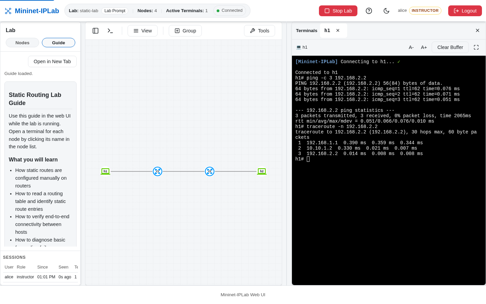

An Instructor authors a **Lab Example** in the core repository and uses it to create a **Lab**. The Lab Example is
the repeatable Python recipe; the Lab is the one emulated network running now. Keep that distinction in mind while
reading the rest of this guide.

The core repository's source-backed [Creating a Lab guide](https://github.com/mininet-iplab/mininet-iplab/blob/v0.1.0/docs/CREATE_LAB.md)
is the detailed reference for this release. This page explains the model, the authoring path, and the boundary
between Instructor-owned Lab shape and Learner-controlled exercise behavior.

## The authoring path

Use this order for every new Lab Example:

1. **Prepare the environment.** Complete [Prerequisites](/docs/getting-started/prerequisites/) and run the
   [Quick Start](/docs/getting-started/quickstart/) once.
2. **Define the lesson.** Write the networking objective, the observation that proves it, and the Nodes, Links,
   addresses, and routing behavior the lesson needs.
3. **Create the Lab Example.** Add `examples/my-lab.py` in the core repository and construct the base `mnIPLab`
   object inside `build_network()`.
4. **Build the shape.** Add Nodes first, then Links and interface addresses. Keep the Topology small enough that a
   Learner can explain every Node and Link.
5. **Add the capability.** Use the [Features](/docs/features/) cookbook to add the exact routing, Service, IPv6,
   Container Host, or ExaBGP API your lesson needs.
6. **Run and verify.** Test both CLI Mode and, when useful, Web UI Mode. Compare the observed route, Service response,
   or protocol state with the Guide before publishing it.

This sequence separates setup failures from Lab authoring failures and keeps the feature code attached to the object
that owns it.

## The Lab model

These terms describe different things:

| Term | Meaning | Authoring responsibility |
| --- | --- | --- |
| **Lab** | One emulated network running now: its Nodes, Links, and routing state. A Lab starts and stops. | Decide what the running lesson must contain and how it should behave. |
| **Lab Example** | A Python script that builds one Lab and demonstrates a concrete lesson or capability. | Put executable Lab Example files in the core repository's `examples/` directory. |
| **Topology** | The shape of a Lab: which Nodes exist and which Links join them. | Define Nodes, Links, interface addresses, and any switches in the Lab Example. |
| **Node** | A participant in a Lab, such as a Host, Router, Speaker, Container Host, or switch. | Choose each Node's role, name, addresses, and configuration. |
| **Link** | A connection between two Nodes. It carries the traffic being studied. | Connect Nodes and assign the interface parameters needed by the lesson. |
| **Layout** | Presentation positions for the Topology in Web UI Mode. It changes where Nodes are drawn, not how packets route. | Save it as `examples/layouts/<lab-id>.json` with **View → Save as Authored Layout** in the Web UI. |
| **Guide** | A learner-facing walkthrough that accompanies a Lab Example and explains what to try and observe. | Write it as `examples/guides/<lab-id>.md`; Web UI Mode shows it in the **Guide** tab. |

The **Topology** is part of the Lab's shape, but a **Layout** is only a visual arrangement of that shape. A **Guide**
is documentation, not another runtime object. A **Service** is also not a kind of Node: it is a role a Node offers,
such as DHCP, DNS, or a Resolver.

## Lab shape and Exercise Configuration

The Lab Example establishes the Lab shape before the Learner starts working. Shape includes:

- which Nodes exist and what role each Node plays;
- which Links connect those Nodes and which addresses are assigned to their interfaces;
- which routing behavior is configured; and
- which Services run on which Nodes.

**Exercise Configuration** is the set of values or choices an Instructor exposes for a lesson and a Learner is
expected to change. It can control an exercise's inputs—such as a route value, a service setting, or a Link
Condition—without changing the Lab's basic shape. The exact controls depend on the Lab Example and its Guide.

Unless an exercise explicitly says otherwise, a Learner does not add or remove Nodes, rewire Links, replace the
routing design, or start and stop the Lab. This boundary lets an Instructor prepare a reproducible lesson while a
Learner investigates the behavior the lesson is meant to teach.

## CLI Mode and Web UI Mode

**CLI Mode** drives a Lab from the terminal prompt. It is the default mode and is supported by every Lab Example.
The Learner can use the Mininet-IPLab prompt and Node commands to inspect interfaces, routes, and connectivity.

**Web UI Mode** drives the same Lab from a browser. It adds a drawn Topology and in-page Terminals for interactive
classroom use. An Instructor starts the Lab and oversees Sessions; a Learner uses the available Terminals and
exercise controls. Web UI Mode does not create a second Lab or a different Topology.

The runner selects the mode when the Lab Example starts:

```bash
# CLI Mode
python3 examples/my-lab.py

# Web UI Mode
python3 examples/my-lab.py --enable-web
```

The optional Layout affects the Web UI drawing only. It does not add Nodes, create Links, assign addresses, or change
routing state.



## Authoring workflow

### 1. Start with the lesson contract

Before writing Python, write down:

1. the networking objective and the observation that proves it;
2. the Nodes and Links the lesson needs;
3. the address plan and routing behavior;
4. any Services and the Node that offers each Service;
5. the values the Learner may change through Exercise Configuration; and
6. the Guide steps for CLI Mode and, when useful, Web UI Mode.

Keep the first Lab Example small enough that a Learner can explain every Node and Link after the Lab starts. The
[`static-lab` source](https://github.com/mininet-iplab/mininet-iplab/blob/v0.1.0/examples/static-lab.py) is the
canonical small example for the `v0.1.0` release.

### 2. Create the Lab Example in the core repository

Runtime work belongs in the [Mininet-IPLab core repository](https://github.com/mininet-iplab/mininet-iplab), not in
this documentation repository. A Lab Example and its companion files use this layout:

```text
examples/
├── my-lab.py                 # the Lab Example
├── labs.json                 # the Lab Example catalog shown in the Web UI
├── layouts/
│   └── my-lab.json           # optional Web UI Layout
└── guides/
    └── my-lab.md             # optional Guide shown in the Guide tab
frr-config/my-lab/<router>/   # optional Persistent Config
```

The Layout is `examples/layouts/<lab-id>.json` and the in-app Guide is `examples/guides/<lab-id>.md`, where
`<lab-id>` is the Lab Example's file name without `.py`. The Guide tab looks up its file while the Lab is running and
says so when none exists. See [Persistent Config](/docs/build-labs/persistent-config/) for `frr-config/`.

Register the Lab Example in the Web UI catalog so an Instructor can start it from the browser:

```bash
python3 util/gen_labs_json.py examples/my-lab.py   # add or update one entry
python3 util/gen_labs_json.py --check              # list Lab Examples not yet registered
```

The script detects protocols, the Node count, and whether the Lab Example uses Persistent Config, then asks for a
name and description and updates `examples/labs.json`.

### 3. Use the standard runner shape

The core repository exposes `mnIPLab`, `mnIPLabCLI`, `parse_lab_args`, and `run_lab` for the normal Lab Example
workflow. The following is a structural template; the Nodes, Links, and lesson behavior are yours to define:

```python
from mininet.log import info
from mniplab import mnIPLab, mnIPLabCLI, parse_lab_args, run_lab


def build_network():
    mnIPLabCLI.init_hosts_file()
    net = mnIPLab(topo=None, autoSetMacs=True, controller=None)

    # Add Nodes, Links, routing, and Services here.
    return net


if __name__ == '__main__':
    args = parse_lab_args('My Lab')
    run_lab(
        build_network(),
        enable_web=args.enable_web,
        web_host=args.web_host,
        web_port=args.web_port,
        log_level=args.log_level,
    )
```

`build_network()` should construct and return the Lab. The runner owns the common lifecycle so that CLI Mode and Web
UI Mode exercise the same Lab Example.

### 4. Define Nodes

Use the `mnIPLab` network object to create the Nodes that make up the lesson:

```python
r1 = net.addRouter('r1', frr_dir='./frr-config/my-lab/%(name)s')
h1 = net.addHost('h1', ip='192.168.1.2/24', defaultRoute='via 192.168.1.1')
s1 = net.addSwitch('s1')
```

Use `addRouter()` for an IP Router. Pass `proto='OSPF'`, `proto='BGP'`, or another supported protocol when the lesson
needs an FRR routing protocol. Use `addHost()` for an end Node and provide its address and default route when the
lesson requires them. Use `addSwitch()` when a shared Layer 2 segment is part of the Topology.

A **Speaker** is a Node that announces and withdraws routes on demand. ExaBGP is the software used to implement that
role; it is not the domain term. ExaBGP Speakers are **Experimental**, so label a Lab Example that uses
`addExaBGP()` accordingly and tell Learners which parts may still change.

### 5. Connect Nodes with Links

Use `addLink()` to connect two Nodes. Put the interface address for each endpoint in `params1` or `params2`:

```python
net.addLink(
    h1,
    r1,
    params1={'ip': '192.168.1.2/24'},
    params2={'ip': '192.168.1.1/24'},
)
net.addLink(
    r1,
    r2,
    params1={'ip': '10.10.1.1/30'},
    params2={'ip': '10.10.1.2/30'},
)
```

Use a separate subnet for each routed segment and make the address plan visible in the Guide. For dual-stack Labs,
use `ip6` and `defaultRoute6` on Hosts and `ip6` in Link interface parameters. A Link Condition changes the behavior
of an existing Link—for example its delay, loss, or bandwidth—for an exercise; it does not redefine the Topology.

### 6. Add routing behavior

For a static-routing lesson, add the route commands to the appropriate Router after the Nodes and Links are defined:

```python
r1.cmd('ip route add 192.168.2.0/24 via 10.10.1.2')
r2.cmd('ip route add 192.168.1.0/24 via 10.10.1.1')
```

For a protocol lesson, enable the protocol on the Router and add the FRR configuration required by the lesson:

```python
r1 = net.addRouter('r1', proto='OSPF', frr_dir='./frr-config/my-lab/%(name)s')
r1.add_frr_config('''
router ospf
 ospf router-id 1.1.1.1
 network 10.10.1.0/30 area 0
exit
''')
```

Describe the intended routing state in the Guide: which route or neighbor should appear, which command shows it, and
what Learner observation proves the lesson. Do not describe a route as dynamic when the Lab Example installs it with
`ip route`, and do not treat a Link Condition as routing-protocol state.

### 7. Add Services to Nodes

A Service is a role offered by a Node. Author it by choosing the Node that should provide the Service, making the
service software and configuration available in the core runtime, and starting or configuring it as part of the Lab
Example's Node setup. Then document its address, port or query, expected response, and cleanup behavior in the Guide.

There is no generic `net.addService()` and no Service Node type. Add a Service to an existing Host or Router with
`node.addService()`. For example, this attaches a DHCP Pool to a Router and marks a client interface for DHCP:

```python
from mniplab.dhcp import DHCPService, Pool

r1.addService(DHCPService(
    Pool(cidr='10.50.0.0/24', start='10.50.0.100', end='10.50.0.200'),
))
net.addLink(r1, h1, params1={'ip': '10.50.0.1/24'}, params2={'dhcp4': True})
```

`DNSService` and `ResolverService` attach the same way. The [Network Services](/docs/features/dhcp/) feature pages
show each one, and the core [`CREATE_LAB.md` Services section](https://github.com/mininet-iplab/mininet-iplab/blob/v0.1.0/docs/CREATE_LAB.md#services)
and [DHCP Lab Example](https://github.com/mininet-iplab/mininet-iplab/blob/v0.1.0/examples/dhcp-lab.py) have the
complete configuration.

## Validate and publish the authoring work

Run the Lab Example in both supported interaction modes on the Linux-capable development host used by the core
repository:

```bash
python3 examples/my-lab.py
python3 examples/my-lab.py --enable-web
```

For each mode, verify that:

- every expected Node exists with the intended role and address;
- every Link connects the intended endpoints;
- routing state and Service behavior match the Guide;
- the Learner can change only the documented Exercise Configuration; and
- normal exit and interrupted cleanup stop the Lab without leaving resources behind.

If the Web UI is used, arrange the Nodes, choose **View → Save as Authored Layout**, and review the saved Layout separately. A Layout review should confirm that the drawn
Topology is readable; it is not a substitute for testing the Lab's actual Links or routing state.

Finally, register the Lab Example in `examples/labs.json`, add its in-app Guide, and link to the Lab Example source
from any page in this documentation site. Keep executable runtime changes, tests, and release behavior in the core
repository.

## Author checklist

- [ ] The objective and expected Learner observation are written down.
- [ ] Lab, Lab Example, Guide, Topology, Node, Link, Layout, and Service are used with their intended meanings.
- [ ] Lab shape is separate from Learner Exercise Configuration.
- [ ] CLI Mode and Web UI Mode are both explained when the Lab supports both.
- [ ] Nodes, Links, addresses, routing, and Services are source-backed by the core repository.
- [ ] Experimental Speakers are labeled Experimental.
- [ ] The Lab Example is registered in `examples/labs.json` and has a Guide and a Layout.
