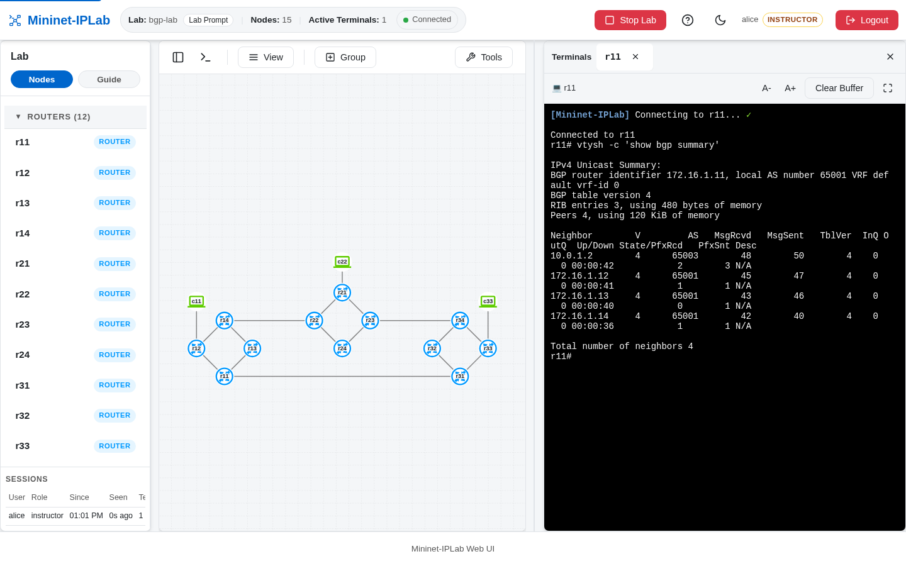

BGP needs two BGP Routers, an addressed Link between their peers, an AS number on each Router, and a `network`
statement for every prefix that should be advertised.

## Add it to a Lab

Enable BGP on the Routers:

```python
r1 = net.addRouter('r1', proto='BGP')
r2 = net.addRouter('r2', proto='BGP')

net.addLink(r1, r2,
            params1={'ip': '10.10.1.1/30'},
            params2={'ip': '10.10.1.2/30'})
```

Configure each side with the other side's address and AS:

```python
r1.add_frr_config('''
router bgp 65001
 bgp router-id 1.1.1.1
 neighbor 10.10.1.2 remote-as 65002
 address-family ipv4 unicast
  network 192.168.1.0/24
 exit-address-family
exit
''')

r2.add_frr_config('''
router bgp 65002
 bgp router-id 2.2.2.2
 neighbor 10.10.1.1 remote-as 65001
 address-family ipv4 unicast
  network 192.168.2.0/24
 exit-address-family
exit
''')
```

The advertised networks must exist in the Router's route table. Add Host-facing Links or other route sources before
expecting BGP to announce them. For iBGP inside an AS, run an OSPF underlay on the same Routers with
`proto='BGP,OSPF'`, as `bgp-lab` does.

### Steer path selection

Attach route-maps to a neighbor to set the attributes BGP compares. `LOCAL_PREF` chooses the exit from your own AS;
`MED` (`set metric`) asks a neighboring AS which entrance to use:

```python
r2.add_frr_config('''
ip prefix-list H3-NETWORKS seq 5 permit 192.168.2.0/24
route-map EXPORT_TO_65001 permit 5
 match ip address prefix-list H3-NETWORKS
 set metric 50
exit
route-map IMPORT_FROM_65001 permit 5
 set local-preference 100
exit
router bgp 65002
 address-family ipv4 unicast
  neighbor 10.10.0.1 route-map IMPORT_FROM_65001 in
  neighbor 10.10.0.1 route-map EXPORT_TO_65001 out
 exit-address-family
exit
''')
```

To install more than one equal-cost BGP path, add `maximum-paths 2` (or `maximum-paths ibgp 2`) to the address
family. [`bgp-medlopref-lab.py`](https://github.com/mininet-iplab/mininet-iplab/blob/v0.1.0/examples/bgp-medlopref-lab.py)
and [`bgp-multipath-lab.py`](https://github.com/mininet-iplab/mininet-iplab/blob/v0.1.0/examples/bgp-multipath-lab.py)
are complete examples.

## Verify it

Inspect the session, then the learned BGP table:

```bash
r1 vtysh -c 'show bgp summary'
r1 vtysh -c 'show bgp ipv4 unicast'
```



Run `vtysh -c 'show bgp ipv4 unicast 192.168.2.0/24'` to see why BGP picked a path: the chosen route is marked
`best` with the attribute that decided it. [Packet Capture](/docs/features/packet-capture/) with the **BGP** preset
shows the OPEN, UPDATE, and KEEPALIVE messages when a session resets.

Use [`bgp-lab.py`](https://github.com/mininet-iplab/mininet-iplab/blob/v0.1.0/examples/bgp-lab.py)
for a complete multi-AS example. Use the source example to compare the configuration with the observed session and
learned prefixes.
