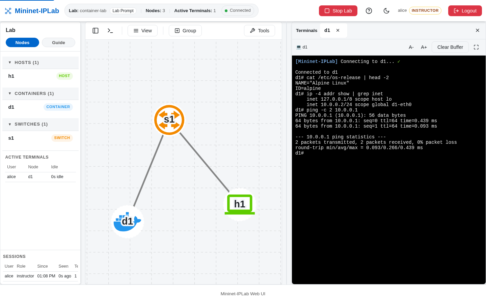

A Container Host is a Lab Node backed by a Docker image. Use it when the lesson needs real application software,
such as a web server, database, or client stack, rather than a bare Mininet Host.

## Add it to a Lab

Use `LinuxBridge` in the example below so the topology does not depend on Open vSwitch for this connection:

```python
from mininet.nodelib import LinuxBridge

net = mnIPLab(
    topo=None,
    autoSetMacs=True,
    controller=None,
    switch=LinuxBridge,
)

h1 = net.addHost('h1', ip='10.0.0.1/24')
d1 = net.addContainer(
    'd1',
    ip='10.0.0.2/24',
    dimage='alpine:3.20',
    dcmd='sleep infinity',
)
s1 = net.addSwitch('s1')
net.addLink(h1, s1)
net.addLink(s1, d1)
```

`dimage` is required. Pass `dcmd` when the image's default command does not keep the application alive; otherwise the
Container Host cannot be inspected after startup.

## Verify it

Run `nodes`, then test the connection from `h1`:

```bash
nodes
h1 ping -c 3 10.0.0.2
```



The runnable [`container-lab.py`](https://github.com/mininet-iplab/mininet-iplab/blob/v0.1.0/examples/container-lab.py)
uses the same pattern. Its Container Host Terminal enters the Docker container rather than a bare network namespace.
