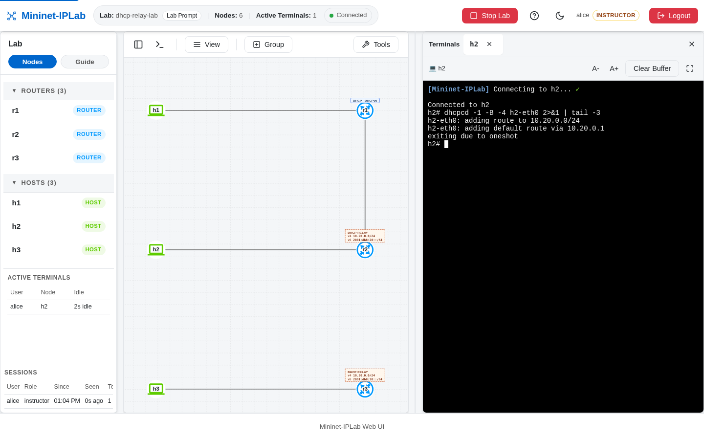
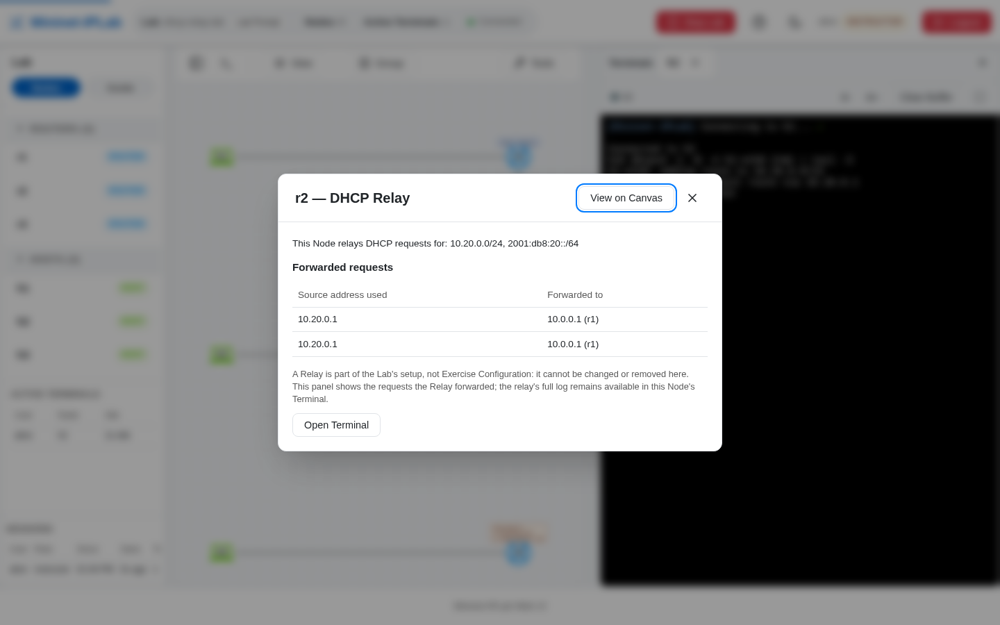

In real networks one central DHCP server serves many Subnets through the Routers in between. A **Relay** models that
Router: it forwards a client's requests to the Service's address and holds no Pool of its own. A Relay belongs to the
Lab's shape, so the Instructor declares it and a Learner can see it but not change it.

## Add it to a Lab

Declare every Pool, direct and relayed, on the central Service, then attach a `Relay` to the Router that fronts the
remote clients:

```python
from mniplab.dhcp import DHCPService, Pool, Relay

# Central Service on r1: one direct Subnet, one relayed Subnet
r1.addService(DHCPService(
    Pool(cidr='10.10.0.0/24', start='10.10.0.100', end='10.10.0.200'),
    Pool(cidr='10.20.0.0/24', start='10.20.0.100', end='10.20.0.200'),
))

# Relay on r2: cover the remote Subnets and name the Service's addresses
r2.addRelay(Relay('10.20.0.0/24', '2001:db8:20::/64', server=['10.0.0.1', '2001:db8:0::1']))
```

The Relay must name the Service's unicast address with `server=`. A Pool for a Subnet elsewhere in the Lab with no
Relay covering it stops the Lab at start, and the message shows the `addRelay(...)` line to add. A Relay that names
an address no Node owns only warns, so an unreachable-server exercise can be staged on purpose. A Node cannot relay
and serve the same Subnet.

On a relayed IPv6 Subnet the Relay inserts the client's link-layer address (RFC 6939), so an IPv6 Reservation can
match by MAC address, which a directly attached IPv6 Subnet cannot do.

## Verify it

Run the client on a Host behind the Relay:

```bash
dhcpcd -1 -B -d -4 h2-eth0
```

In Web UI Mode each relaying Router carries a `DHCP RELAY` badge listing the Subnets it covers, and the relayed
exchange is drawn as a dashed **Relay Path** from the client Subnet through the Relay to the Service:



The Relay panel lists the requests the Router forwarded and where it sent them; `show_relay_activity r2` shows the
same at the Lab Prompt. On `r1`, the relayed Lease carries the relaying Router in its **Via** column.



[`dhcp-relay-lab.py`](https://github.com/mininet-iplab/mininet-iplab/blob/v0.1.0/examples/dhcp-relay-lab.py) is
dual-stack and adds a staged failure: `r3` relays to an address no Node owns, so `h3`'s requests time out.
