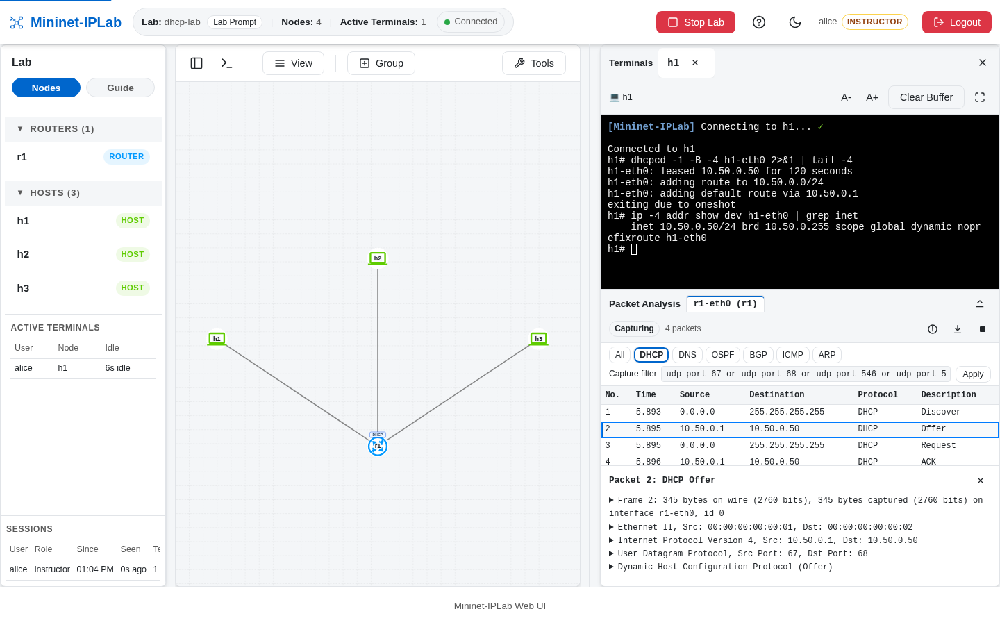
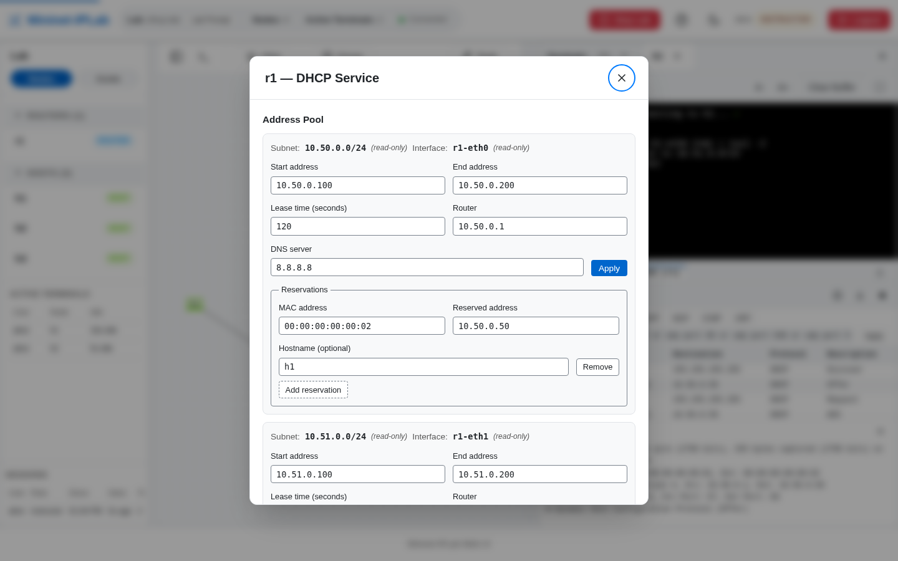

DHCP has two separate authoring steps: attach a `DHCPService` with one `Pool` per served Subnet, then mark a client
interface as a DHCP client. The framework does not acquire a Lease for the Learner: the Learner runs the client and
watches the exchange happen. The Service is backed by Kea.

## Add it to a Lab

Attach the Service to a Router or Host. The `Pool.cidr` must match a Subnet on one of that Node's interfaces:

```python
from mniplab.dhcp import DHCPService, Pool, Reservation

h1 = net.addHost('h1')
h1_mac = h1.params['mac']          # the MAC autoSetMacs assigned

r1.addService(DHCPService(
    Pool(
        cidr='10.50.0.0/24', start='10.50.0.100', end='10.50.0.200',
        lease_time=120, router='10.50.0.1', dns_server='8.8.8.8',
        reservations=(Reservation(mac=h1_mac, ip='10.50.0.50', hostname='h1'),),
    ),
    Pool(cidr='10.51.0.0/24', start='10.51.0.100', end='10.51.0.200'),
))
```

On the client side of a Link, use `dhcp4=True` instead of a static IPv4 address:

```python
net.addLink(r1, h1, params1={'ip': '10.50.0.1/24'}, params2={'dhcp4': True})
```

A **Reservation** gives one client a fixed address, identified by its MAC address (never by hostname). Pin the MAC
through `addLink`'s top-level `addr1`/`addr2`, or read the one `autoSetMacs` assigned from `host.params['mac']`.

A Pool CIDR that matches no interface stops the Lab at start with a message naming it. To serve a Subnet that is
not on the Service's own Node, add a [DHCP Relay](/docs/features/dhcp-relay/). For IPv6, see
[DHCPv6](/docs/features/dhcpv6/).

### Two Services on one Subnet

A second Service on the same Subnet is a misconfiguration in production and a deliberate lesson here: nothing
validates against it, so a Learner can watch a client take a Lease from the rogue server. The
[`dhcp-lab-rogue.py`](https://github.com/mininet-iplab/mininet-iplab/blob/v0.1.0/examples/dhcp-lab-rogue.py) Lab
Example puts both Services on a shared switch.

## Verify it

Run the client inside `h1` after the Lab starts:

```bash
dhcpcd -1 -B -d -4 h1-eth0
ip -4 addr show dev h1-eth0
```

`h1` receives its Reservation, `10.50.0.50`. Capture `r1-eth0` with the **DHCP** preset to see the four messages
(Discover, Offer, Request, ACK) arrive while the client runs:



Then inspect the Leases with `show_leases r1` at the [Lab Prompt](/docs/features/lab-prompt/), or select the `DHCP`
badge on `r1` to open the Service panel. Its **Address Pool** section edits lease time, router, DNS server, and
Reservations on the running Kea without a restart; **Active Leases** lists every Lease with its hardware address.



The complete example is
[`dhcp-lab.py`](https://github.com/mininet-iplab/mininet-iplab/blob/v0.1.0/examples/dhcp-lab.py), and the core
[`DHCP.md`](https://github.com/mininet-iplab/mininet-iplab/blob/v0.1.0/docs/DHCP.md) covers every option.
