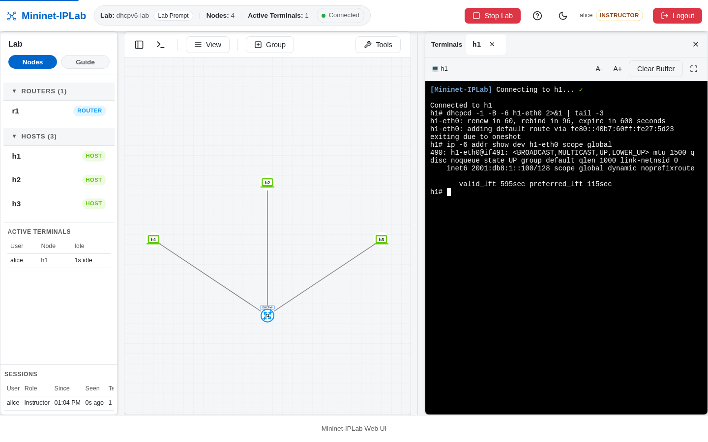

A `Pool` whose CIDR is an IPv6 prefix is a DHCPv6 Pool; there is no separate declaration. What DHCPv6 adds is the
**Router Advertisement**: a client does not start DHCPv6 until a Router Advertisement sets the Managed (M) or Other
(O) flag, and its default route always comes from the Router Advertisement. The flags are the lesson, so the
Instructor writes them as FRR configuration rather than generating them.

## Add it to a Lab

Mark the client interface with `dhcp6=True` and declare an IPv6 Pool:

```python
from mniplab.dhcp import DHCPService, Pool

net.addLink(r1, h1, params1={'ip6': '2001:db8:1::1/64'}, params2={'dhcp6': True})

r1.addService(DHCPService(
    Pool(
        cidr='2001:db8:1::/64', start='2001:db8:1::100', end='2001:db8:1::200',
        lease_time=600, preferred_lifetime=120,
    ),
))
```

Then send a Router Advertisement with the flag you want:

```python
r1.add_frr_config(
    'interface r1-eth0\n'
    ' ipv6 nd prefix 2001:db8:1::/64 no-autoconfig\n'   # A=0: no SLAAC address from this prefix
    ' ipv6 nd managed-config-flag\n'                    # M=1: ask DHCPv6 for an address
    ' no ipv6 nd suppress-ra'                           # FRR suppresses Router Advertisements by default
)
```

Use `ipv6 nd other-config-flag` instead of the managed flag for stateless DHCPv6: the client fetches options such as
the DNS server and gets no address. Two fields differ from IPv4: an IPv6 Pool has no `router` option (declaring one
is an error), and `preferred_lifetime` must not exceed `lease_time`.

At start, the Lab warns rather than fails when a served Subnet has no Router Advertisement with the M flag, or when a
served prefix still allows autoconfiguration. Both are stageable lessons, and each warning names the FRR line that
would change it.

## Verify it

Run the client with `-6`:

```bash
dhcpcd -1 -B -d -6 h1-eth0
ip -6 addr show dev h1-eth0 scope global
```



[`dhcpv6-lab.py`](https://github.com/mininet-iplab/mininet-iplab/blob/v0.1.0/examples/dhcpv6-lab.py) stages all three
outcomes on one Router: `h1` behind the M flag gets an address, `h2` behind the O flag gets only DNS servers, and
`h3` with no Router Advertisement gets nothing at all. The v6 Leases, identified by DUID, appear in the `DHCPv6`
table of the Service panel and in `show_leases r1 6`.
