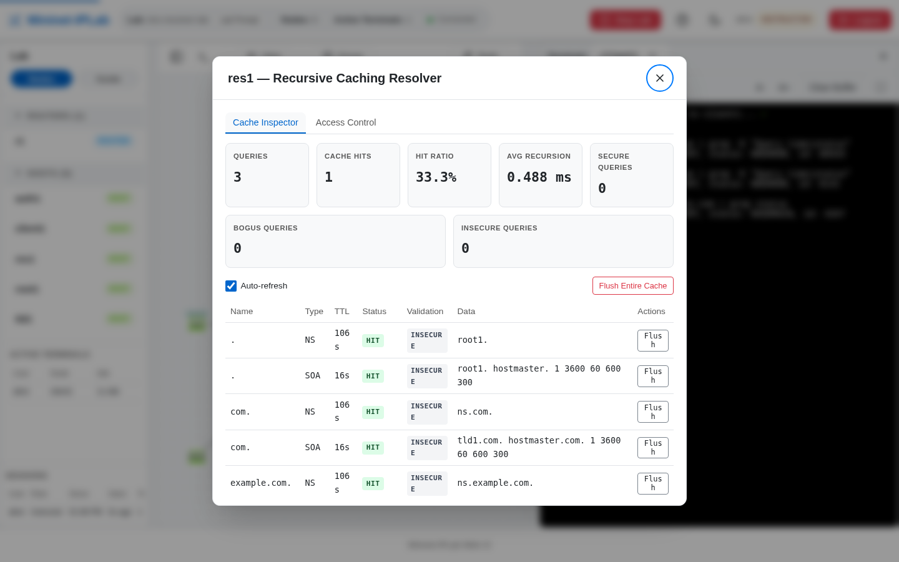

A Resolver answers clients by asking other nameservers: it walks Root → TLD → Authoritative, caches what it learns,
and answers the next query from the cache. A Lab has no route to the public root servers, so the Resolver is seeded
with **Root Hints** that name the Lab's own root nameserver. The Service is backed by Unbound.

## Add it to a Lab

Build the hierarchy with [authoritative DNS Services](/docs/features/dns/): a `.` Zone on `root1` delegating `com.`,
a `com.` Zone delegating `example.com.`, and the `example.com.` Zone itself. Then attach the Resolver:

```python
from mniplab.resolver import ResolverService

res1 = net.addHost('res1', ip='10.0.4.2/24', defaultRoute='via 10.0.4.1')
res1.addService(ResolverService(root_hints=[root1]))

client1 = net.addHost('client1', ip='10.0.5.2/24', defaultRoute='via 10.0.5.1',
                      nameservers=['10.0.4.2'])
```

Other options:

- `forwarders=['10.0.0.1']` passes every query upstream instead of walking the hierarchy. If you declare both,
  forwarding wins and a start-time warning says so.
- `max_ttl` (300 s by default) and `max_negative_ttl` (60 s) cap cached TTLs so an exercise never waits out a
  production-length TTL.
- `access_control=[AccessRule('10.0.0.0/8', 'allow'), AccessRule('10.0.9.0/24', 'refuse')]` (from
  `mniplab.resolver`) limits which clients may ask. Actions are `allow`, `refuse`, and `deny`.

The Lab refuses to start when the Resolver can never resolve anything, such as no Root Hints, no forwarders, and no
default route. It warns and runs when the misconfiguration is the lesson, such as Root Hints aimed at a Node that does
not host the `.` Zone.

## Verify it

From the client, ask the same name twice and a name that does not exist:

```bash
dig web.example.com | grep -E "Query time|status"
dig web.example.com | grep -E "Query time|status"
dig missing.example.com | grep status
```

The first query walks the hierarchy; the second is answered from the cache and is faster; the third returns
`NXDOMAIN` and is cached as a negative answer. Select the teal `RESOLVER` badge on `res1` to open the **Cache
Inspector**: query and hit counters, then every cached entry with a `HIT`, `NXDOMAIN`, or `NODATA` status and a TTL
that counts down. Flush one entry, or the whole cache, to make the next query walk again. The **Access Control** tab
edits the rules and applies them with a hot reload that keeps the cache.



At the Lab Prompt use `show_resolver res1`, `show_cache res1`, `flush_cache res1 [name]`, and
`resolver_access res1`. The complete example is
[`dns-resolver-lab.py`](https://github.com/mininet-iplab/mininet-iplab/blob/v0.1.0/examples/dns-resolver-lab.py).
