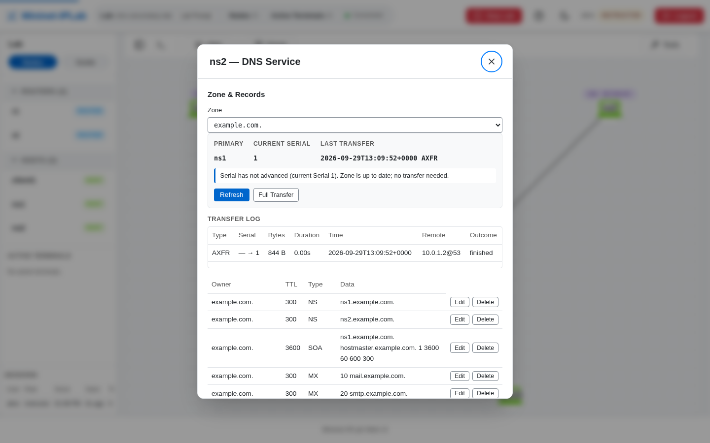

A Secondary nameserver holds a copy of a Zone it does not own. It takes a full copy (AXFR) from the Primary, and
whenever the Primary's Serial moves, the Primary sends a **Notify** and the Secondary fetches the difference (IXFR).

## Add it to a Lab

Give the Primary an ordinary Zone and the Secondary a `SecondaryZone` naming the Primary:

```python
from mniplab.dns import DNSService, SecondaryZone, Zone

ns1.addService(DNSService(Zone('example.com.', records, host_node='ns1')))
ns2.addService(DNSService(SecondaryZone('example.com.', primary=ns1)))
```

`primary` is the Node or its IP address. A Secondary carries no Records of its own: they arrive over the wire, and
passing any is rejected. The Primary's transfer ACL is derived from the Secondaries declared against it. To stage a
refused transfer, give the Primary an explicit `allow_transfer=['10.0.9.9']`, which replaces the derived ACL.

The generated SOA timers suit a classroom: `retry 60`, `expire 600`, and a deliberately long `refresh 3600`, so that
when a change arrives quickly a Learner can tell Notify caused it and not the timer.

## Verify it

Select the `DNS · SECONDARY` badge on the Secondary. The panel names the Primary, the current Serial, and the last
transfer, and shows the replication state (`Zone replicated and up to date`, `Primary unreachable`,
`Transfer refused`, `Zone expired: answering SERVFAIL`, or `Serial not advanced`) above the **Transfer Log**.
**Refresh** asks the Primary whether its Serial moved; **Full Transfer** forces a complete copy.



Add a Record on the Primary (in its DNS panel, or with `dns_records ns1 example.com. add ...`), and the Secondary
logs an IXFR to the new Serial within seconds. At the Lab Prompt, `show_dns_transfers ns2`, `dns_refresh ns2
example.com.`, and `dns_retransfer ns2 example.com.` do the same from the command line.

[`dns-secondary-lab.py`](https://github.com/mininet-iplab/mininet-iplab/blob/v0.1.0/examples/dns-secondary-lab.py)
puts the Primary and Secondary either side of a [RIP](/docs/features/other-protocols/) core, so disconnecting the core
Link shows `Primary unreachable` and, after `expire`, a Secondary answering `SERVFAIL`.
