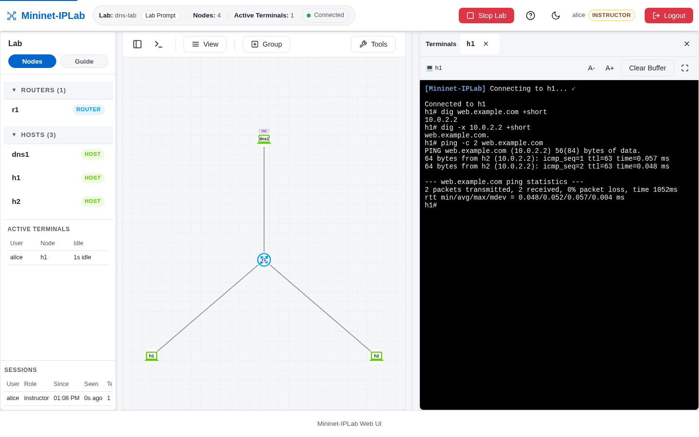
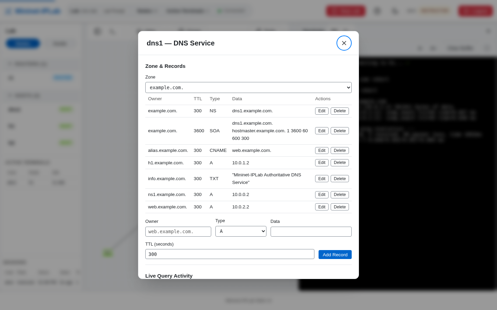

DNS is added as a Service on an existing Node. An authoritative Service, backed by Knot DNS, hosts one or more
Zones and answers for them.

## Add it to a Lab

Create a DNS Host, give it an address, and attach a Zone:

```python
from mniplab.dns import ARecord, CNAMERecord, DNSService, Zone

dns1 = net.addHost('dns1', ip='10.0.0.2/24', defaultRoute='via 10.0.0.1')
dns1.addService(DNSService(Zone(
    'example.com.',
    [
        ARecord('web', '10.0.2.2'),
        CNAMERecord('alias', 'web.example.com.'),
    ],
    host_node='dns1',
)))
```

Point client Hosts at that Node with `nameservers`:

```python
h1 = net.addHost(
    'h1',
    ip='10.0.1.2/24',
    defaultRoute='via 10.0.1.1',
    nameservers=['10.0.0.2'],
)
```

The `nameservers` setting gives the emulated Host its own resolver configuration; it does not change the machine
running the Lab.

To give clients a caching Resolver that walks the hierarchy instead, see
[Recursive Resolver](/docs/features/dns-resolver/). To replicate a Zone to a second nameserver, see
[Secondary nameserver](/docs/features/dns-secondary/).

## Verify it

From a client Terminal:

```bash
dig web.example.com
ping web.example.com
```



Inspect a Service with `show_dns dns1` and `show_dns_records dns1 example.com.` at the Lab Prompt, or select the
`DNS` badge on `dns1`. The DNS panel lists the Zone's Records and lets a Learner add, edit, or delete them in one
atomic transaction; **Live Query Activity** counts queries by type and response code as clients ask.



See the complete [`DNS.md`](https://github.com/mininet-iplab/mininet-iplab/blob/v0.1.0/docs/DNS.md)
and [`dns-lab.py`](https://github.com/mininet-iplab/mininet-iplab/blob/v0.1.0/examples/dns-lab.py).
