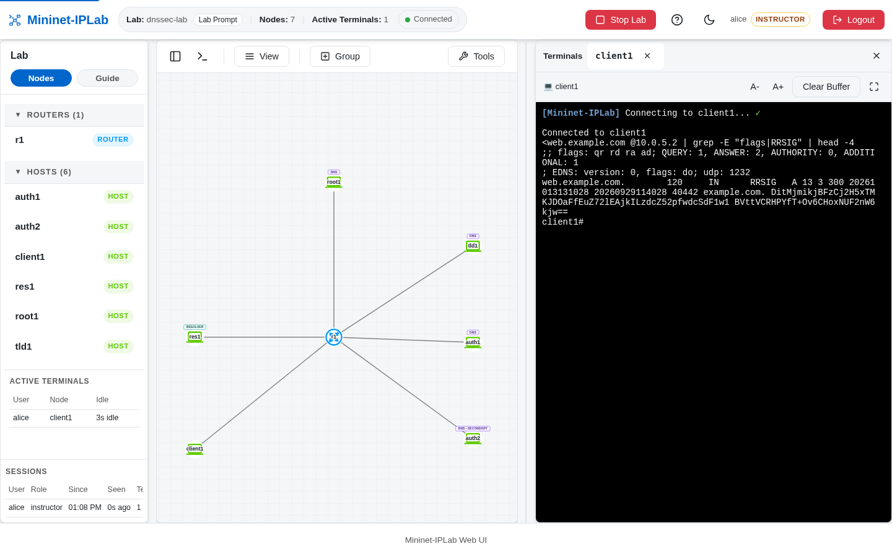
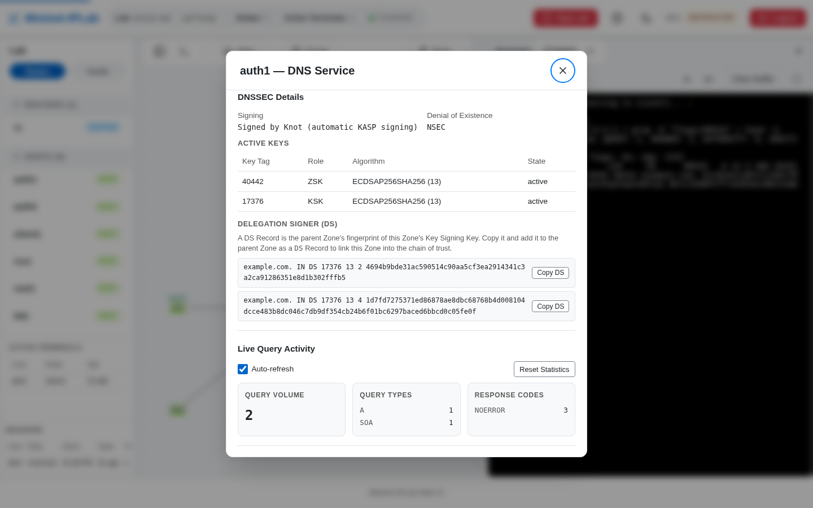

DNSSEC has two sides: a Primary Zone signs records, and a Resolver validates the chain using a Trust Anchor. A signed
Zone by itself does not prove that a client is validating responses.

## Add it to a Lab

Mark the authoritative Zone as signed:

```python
from mniplab.dns import ARecord, DNSService, Zone

example_zone = Zone(
    'example.com.',
    [
        ARecord('web', '10.0.6.100'),
        ARecord('mail', '10.0.3.2'),
    ],
    host_node='auth1',
    dnssec=True,
)
auth1.addService(DNSService(example_zone))
```

Attach a validating Resolver and give it the Root Host as a Trust Anchor:

```python
from mniplab.resolver import ResolverService

res1.addService(ResolverService(
    root_hints=[root1],
    trust_anchors=[root1],
))
```

The complete DNSSEC Lab also declares signed Root and `com.` Zones, DS records between parents and children, and a
Secondary. Use that source rather than inventing a partial hierarchy when the lesson is about delegation.

## Verify it

From the client Host, ask for DNSSEC data and check the authenticated-data flag:

```bash
dig +dnssec web.example.com @10.0.5.2
delv web.example.com @10.0.5.2
```

A validated answer carries the `ad` (authenticated data) flag and an `RRSIG` beside the `A` record:



Select the `DNS` badge on `auth1` to see the signed Zone. The panel marks it **Signed**, can reveal the `RRSIG` and
`NSEC` Records the editor otherwise hides, and its **DNSSEC Details** section lists the active keys and the `DS`
records the parent Zone must publish, each with a **Copy DS** button. Run `dnssec_rollover auth1 example.com. zsk` at
the Lab Prompt to roll the Zone Signing Key while clients keep validating. On the Resolver, the
[Cache Inspector](/docs/features/dns-resolver/) shows each cached answer as `SECURE`, `BOGUS`, or `INSECURE`.



The source-backed [`dnssec-lab.py`](https://github.com/mininet-iplab/mininet-iplab/blob/v0.1.0/examples/dnssec-lab.py)
contains the full Root → TLD → Authoritative → Resolver topology. The broader DNS Service reference is in
[`DNS.md`](https://github.com/mininet-iplab/mininet-iplab/blob/v0.1.0/docs/DNS.md).
