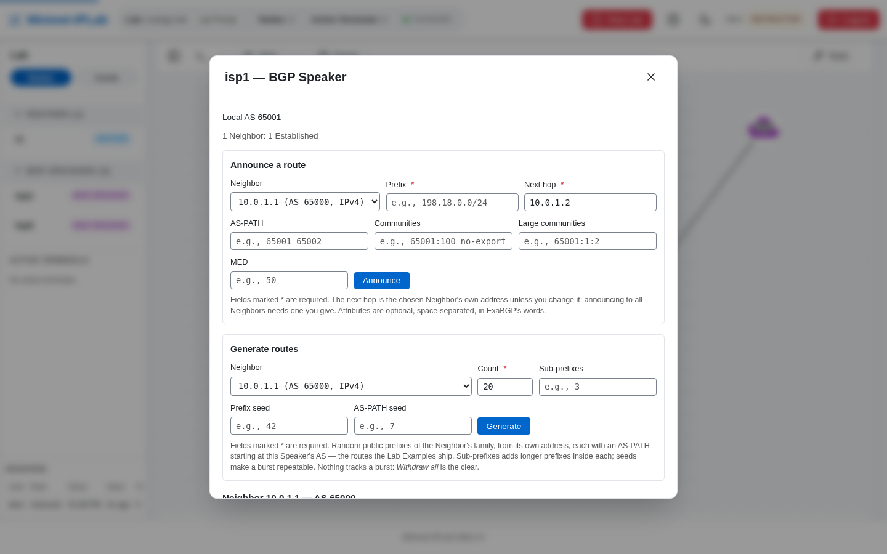

An ExaBGP Speaker is a Node that announces and withdraws routes to an FRR Router. It is not a replacement for the
Router and it is not a normal Host-only routing protocol setting.

## Add it to a Lab

Define a BGP neighbor and add the Speaker:

```python
from mniplab.exabgp import BGPNeighbor, make_v6_peer_routes

neighbor = BGPNeighbor(
    peer='2001:db8:1::1',
    local_address='2001:db8:1::2',
    local_as=65001,
    peer_as=65000,
)

speaker = net.addExaBGP(
    'isp1',
    neighbors=[neighbor],
    routes=make_v6_peer_routes(
        num_prefixes=8,
        local_asn=65001,
        next_hop='2001:db8:1::2',
    ),
    local_as=65001,
)
```

Add a BGP Router, configure its `neighbor ... remote-as ...` line, and connect the two Nodes with matching IPv6
addresses. The Speaker is passive: the FRR Router opens the session.

## Verify it

Inspect the session and route table from the Router:

```bash
r1 vtysh -c 'show bgp summary'
r1 vtysh -c 'show bgp ipv6 unicast'
```

In Web UI Mode, right-click the Speaker and choose **Open Speaker**. The panel lists each Neighbor with its session
state and the routes sent and received, and it can announce a route with AS-PATH, communities, and MED, generate a
burst of random routes, or withdraw them. At the Lab Prompt use `show_speaker`, `announce`, and `withdraw`.



The complete IPv6 example is [`exabgp-ipv6-lab.py`](https://github.com/mininet-iplab/mininet-iplab/blob/v0.1.0/examples/exabgp-ipv6-lab.py).
For runtime announcements, FIFO control, and route validation, read the core [`EXABGP.md`](https://github.com/mininet-iplab/mininet-iplab/blob/v0.1.0/docs/EXABGP.md).
