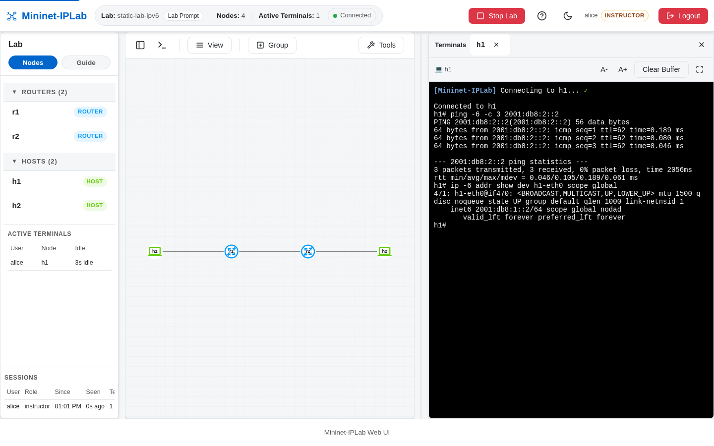

IPv6 is added explicitly. An IPv4 address does not create an IPv6 address or route, so put the address family on both
the Host and the Link interface.

## Add it to a Lab

Give Hosts an IPv6 address and default gateway:

```python
h1 = net.addHost(
    'h1',
    ip6='2001:db8:1::2/64',
    defaultRoute6='via 2001:db8:1::1',
)
h2 = net.addHost(
    'h2',
    ip6='2001:db8:2::2/64',
    defaultRoute6='via 2001:db8:2::1',
)
```

Put IPv6 addresses on the corresponding Link interfaces:

```python
net.addLink(h1, r1, params2={'ip6': '2001:db8:1::1/64'})
net.addLink(h2, r2, params2={'ip6': '2001:db8:2::1/64'})
net.addLink(r1, r2,
            params1={'ip6': '2001:db8:ff::1/64'},
            params2={'ip6': '2001:db8:ff::2/64'})
```

For an IPv6 static-routing lesson, add IPv6 routes on the Routers. For OSPFv3 or BGP IPv6, add the corresponding
FRR address-family configuration as well.

## Verify it

Use IPv6 commands when testing the IPv6 path:

```bash
ping -6 -c 3 2001:db8:2::2
r1 ip -6 route
r1 vtysh -c 'show ipv6 route'
```



The complete source-backed example is [`static-lab-ipv6.py`](https://github.com/mininet-iplab/mininet-iplab/blob/v0.1.0/examples/static-lab-ipv6.py).
Compare its IPv6 addresses, route table, and `ping -6` result with the IPv4 version of the Lab.
