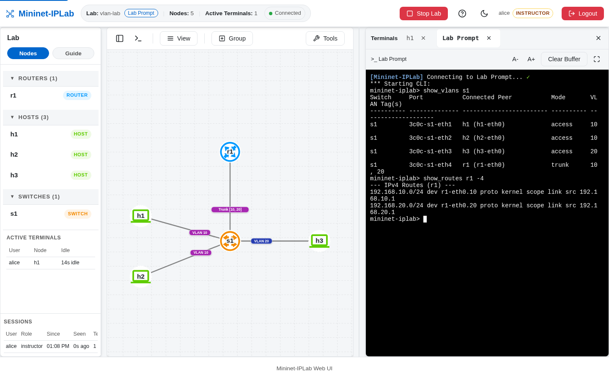

The Lab Prompt is the `mininet-iplab>` command line of a running Lab. A Node Terminal works inside one Node; the Lab
Prompt works across the whole Lab: it lists every address, shows any Node's routes, reads a Service's Leases or
Records, configures a Link, and runs Mininet's own commands such as `pingall`.



## Add it to a Lab

Every Lab Example has one. In CLI Mode it is the prompt the Lab Example opens. In Web UI Mode the **Lab Prompt**
button beside the Lab name opens it in a Terminal tab. There is one shared Lab Prompt per running Lab: output goes to
every viewer, and input from any viewer is written through. `py` commands run inside that Lab's own process and cannot
reach the server or another Lab.

## Commands

Mininet's own commands (`pingall`, `net`, `nodes`, `dump`, `py`, `<node> <command>`) work as usual. Mininet-IPLab
adds:

| Command | What it does |
| --- | --- |
| `show_ips` | Every IPv4 and IPv6 interface address in the Lab |
| `show_routes <node> [-4\|-6]` | A Node's kernel routing table |
| `update_hosts` | Rewrite the shared `/etc/hosts` with every Node address |
| `link_config <n1> <n2> [delay=] [jitter=] [loss=] [bw=] [htb\|tbf]` | Set a [Link Condition](/docs/features/link-conditions/) |
| `iperf3 <server> <client> [seconds=10] [protocol=tcp\|udp] [json]` | Measure throughput between two Nodes |
| `show_vlans [switch]`, `vlan <switch> <port> <access\|trunk\|none> [ids]` | Inspect or change [switch VLANs](/docs/features/vlans/) |
| `show_leases <node> [4\|6]` | The Leases a [DHCP Service](/docs/features/dhcp/) holds |
| `show_relay_activity <node>` | Requests a [DHCP Relay](/docs/features/dhcp-relay/) has forwarded |
| `show_dns <node>`, `show_dns_records <node> <zone>` | A [DNS Service](/docs/features/dns/) and its Records |
| `dns_records <node> <zone> add\|del ...` | Add or remove a Record |
| `show_dns_stats <node> [--reset]` | Live DNS query and response counters |
| `show_dns_transfers <node> [zone]`, `dns_refresh`, `dns_retransfer` | [Secondary](/docs/features/dns-secondary/) replication |
| `dnssec_keys <node> <zone>`, `dnssec_rollover <node> <zone> [zsk\|ksk]` | [DNSSEC](/docs/features/dnssec/) keys and rollovers |
| `show_resolver <node>`, `show_cache <node>`, `flush_cache <node> [name]` | The [Recursive Resolver](/docs/features/dns-resolver/) |
| `resolver_access <node> [add <cidr> <action>\|del <cidr>]` | Resolver Access Control |
| `show_speaker <node>`, `announce ...`, `withdraw ...` | An [ExaBGP](/docs/features/exabgp/) Speaker |
| `loglevel <level>`, `showlog` | Mininet-IPLab log level |

Run `help <command>` at the prompt for a command's full usage.

## Verify it

In `static-lab`, open the Lab Prompt and run:

```text
mininet-iplab> show_ips
mininet-iplab> show_routes r1 -4
mininet-iplab> h1 ping -c 2 h2
```

`show_ips` lists the four Nodes' addresses, `show_routes` shows `r1`'s static route to `192.168.2.0/24`, and the ping
crosses both Routers.
