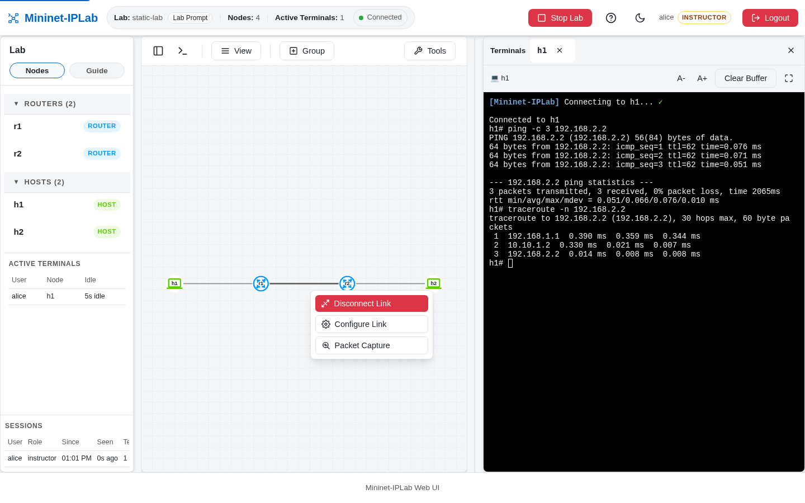
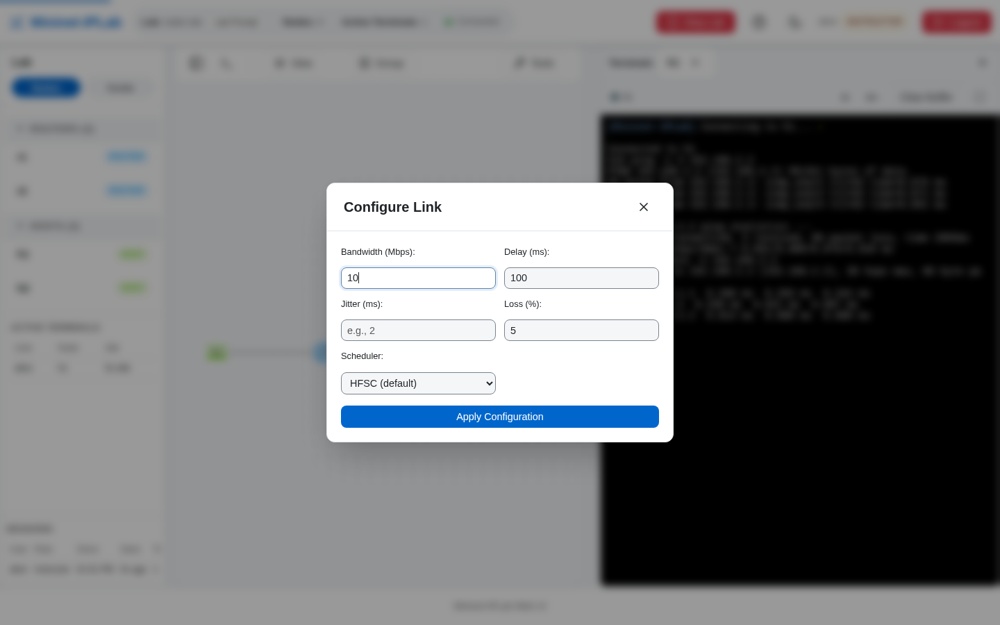
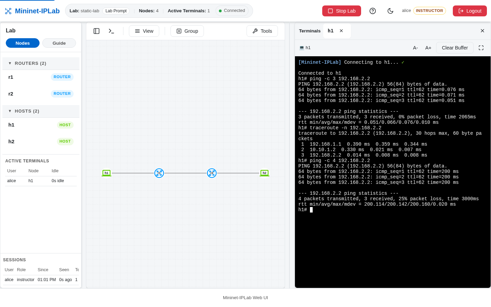

A Link Condition changes how an existing Link behaves while the Lab is running: its delay, jitter, loss, bandwidth,
or whether it is up at all. It does not add a Node, create a Link, or install a route, so it is the tool for lessons
about convergence, retransmission, and throughput on a Topology that stays the same.

## Add it to a Lab

There is no authoring call. Start any Lab Example in [Web UI Mode](/docs/features/web-ui/) and click a Link. Its menu
offers **Disconnect Link** (or **Reconnect Link** on a Link that is down), **Configure Link**, and **Packet Capture**.



**Configure Link** sets bandwidth (Mbps), delay (ms), jitter (ms), loss (%), and the scheduler (HFSC by default, or
HTB or TBF). **Apply Configuration** applies the values to both ends of the Link.



The same change is available from the [Lab Prompt](/docs/features/lab-prompt/) or CLI Mode:

```text
mininet-iplab> link_config r1 r2 delay=100ms loss=5 bw=10
mininet-iplab> link_config r1 r2 delay=10ms jitter=2ms
mininet-iplab> link_config r1 r2 bw=100 htb
```

The Lab records the Link Condition you asked for only after every interface accepted it. If applying it fails, the
change is rejected rather than displayed as if it had worked, so what the Web UI shows is what the Link does.

## Verify it

Measure the Link before and after. With 100 ms of delay on `r1`–`r2` in `static-lab`, a ping from `h1` to `h2`
crosses the Link twice and the round trip grows from well under a millisecond to about 200 ms:



Use **Disconnect Link** on a Link in `ospf-lab` and watch `show ip ospf neighbor` drop the adjacency, then **Reconnect Link**
and watch it return. Use `iperf3 h1 h2` at the Lab Prompt to see a bandwidth limit.
