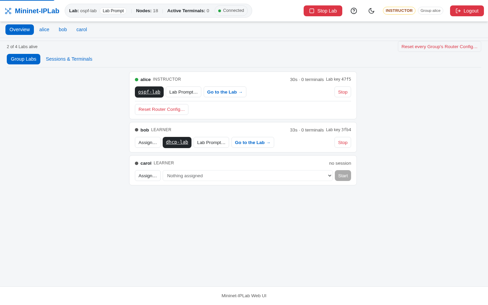
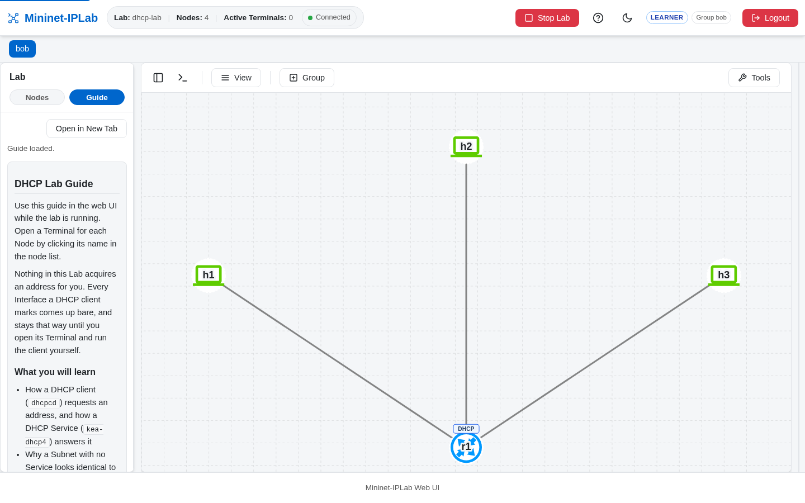

Multi-Lab Mode gives each Group its own running Lab. A Group is a login, and each Group can run one Lab Example at a
time. The Instructor can assign available Lab Examples, see the running Labs, and start or stop a Group's Lab.

## Add it to a Lab

This is a server setting, not a call in `build_network()`. Configure accounts and the mode in `.env`:

```dotenv
MNIPLAB_USERS=teacher:TeachPass1:instructor,table1:Table1Pass:learner
MNIPLAB_LAB_MODE=multi
MNIPLAB_LAB_CAP=4
```

Start the server with `python -m mniplab serve` (or `docker compose exec mniplab python -m mniplab serve` in the
container). The mode is read when the server starts; changing it needs a restart, which comes up with no Lab running.

- **Groups.** Each login in `MNIPLAB_USERS` is a Group, the Instructor's included. A Group runs one Lab at a time and
  sees only its own; the Instructor sees every Lab and can start or stop any Group's.
- **Assignments.** On the Instructor's **Overview** tab, **Group Labs** lists every Group with its Lab, uptime, Terminals,
  and Lab key. **Assign…** chooses which Lab Examples a Group may start; the choice is saved to `assignments.json`
  beside `.env` and never touches a running Lab.
- **The cap.** `MNIPLAB_LAB_CAP` (default four) bounds the Labs alive on the host, for Groups and the Instructor alike.
- **Isolation.** `r1` is `r1` in every copy, and no Lab can reach another: each Lab's bridges, switch ports,
  containers, and Lab directory carry its Lab key, which also appears in `ovs-vsctl show` and `docker ps`.
- **Persistent Config.** A Lab Example with `frr_dir` gets a separate Router config copy per Group; **Start clean**
  resets that Group's copy to the seed. See [Persistent Config](/docs/build-labs/persistent-config/).



A Learner's page shows only its own Group's Lab, with a **Group** badge in the header:



## Verify it

Sign in as two different Groups and start the same Lab Example in each. Each Group should see only its own Lab, while
the Instructor's **Overview → Group Labs** tab shows both with different Lab keys. Stop one Group's Lab and confirm the other
continues running. See the [core Multi-Lab Mode guide](https://github.com/mininet-iplab/mininet-iplab/blob/v0.1.0/docs/web-ui.md#multi-lab-mode)
for Assignments, the Lab cap, and persistent configuration behavior.
