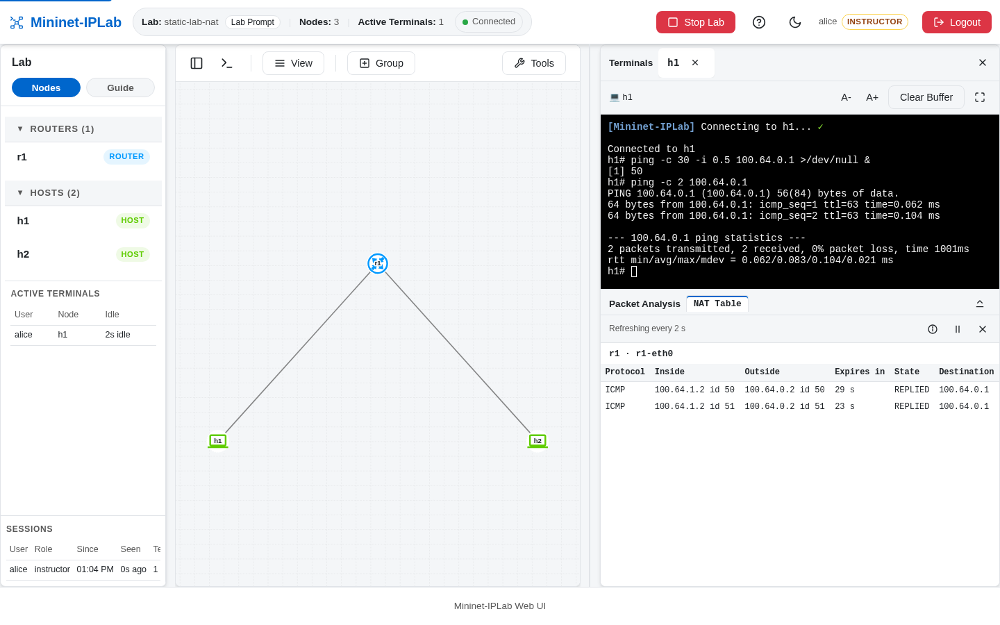

`addNAT()` creates a hidden gateway that connects a Lab to networks outside its emulated Topology. The Router on the
Lab side translates traffic on its NAT-facing Interface. For an ISP path through a Speaker, `addTransit()` also
configures the downstream Router and the Speaker's route toward the gateway.

## Add it to a Lab

Create the gateway and explicitly link it to a Router. Unlike Mininet's built-in `addNAT()`, Mininet-IPLab does not
attach this gateway to a switch automatically:

```python
r1 = net.addRouter('r1')
nat1 = net.addNAT('nat1', subnet='100.64.0.0/23', ip='100.64.0.1/24')
net.addLink(nat1, r1, params2={'ip': '100.64.0.2/24'})
```

The Router also needs Host-facing Links and addresses. For a transit scenario, use `net.addTransit('nat1',
downstream=isp1, ip='192.168.0.1/30')` and link that gateway to an ExaBGP Speaker. Follow the complete
[`bgp-nat-isp-lab.py`](https://github.com/mininet-iplab/mininet-iplab/blob/v0.1.0/examples/bgp-nat-isp-lab.py)
for the Speaker, ISP, and customer Links; see also the simpler
[`static-lab-nat.py`](https://github.com/mininet-iplab/mininet-iplab/blob/v0.1.0/examples/static-lab-nat.py).

## Verify it

In Web UI Mode, send traffic from a Host across the translating Router, then right-click that Router and choose
**NAT Table**. The table opens in the dock and refreshes every two seconds. Each row is one translated connection:
its protocol, the **inside** address and port it came from, the **outside** address the Router substituted (for ICMP,
the echo identifier takes the port's place), how long the entry has left, and its state.



Only translated connections appear, and only the Lab's own Routers: the hidden NAT gateway's translation to the host's
uplink never does. Capture the
Router's Interfaces on both sides to see the source address change. The
[BGP 2 ISP Lab Guide](https://github.com/mininet-iplab/mininet-iplab/blob/v0.1.0/examples/guides/bgp-nat-isp-lab.md#nat-and-the-nat-table)
walks through this comparison with concrete addresses.
