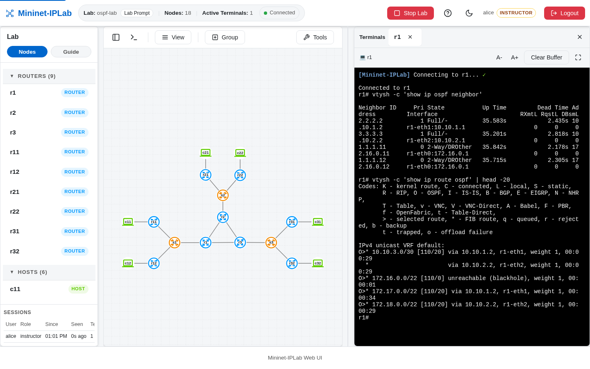

OSPF adds dynamic route learning inside one routing domain. It needs Routers with the OSPF daemon enabled, addressed
Links between them, and FRR configuration that places those networks into an area.

## Add it to a Lab

Create each OSPF Router with `proto='OSPF'`:

```python
r1 = net.addRouter('r1', proto='OSPF')
r2 = net.addRouter('r2', proto='OSPF')
```

Add an addressed inter-router Link, then configure the participating interfaces:

```python
net.addLink(r1, r2,
            params1={'ip': '10.10.1.1/30'},
            params2={'ip': '10.10.1.2/30'})

r1.add_frr_config('''
router ospf
 ospf router-id 1.1.1.1
 network 10.10.1.0/30 area 0
exit
''')

r2.add_frr_config('''
router ospf
 ospf router-id 2.2.2.2
 network 10.10.1.0/30 area 0
exit
''')
```

Add the Host-facing networks to the OSPF configuration too if the lesson should advertise them. Use the same
`build_network()` and `run_lab()` shape from [Create a Lab](/docs/build-labs/).

## Verify it

Wait for adjacency, then inspect the neighbor and route state:

```bash
r1 vtysh -c 'show ip ospf neighbor'
r1 vtysh -c 'show ip route ospf'
```



The complete nine-Router example is [`ospf-lab.py`](https://github.com/mininet-iplab/mininet-iplab/blob/v0.1.0/examples/ospf-lab.py).
Use its neighbor and route commands to observe convergence when a Link changes.
