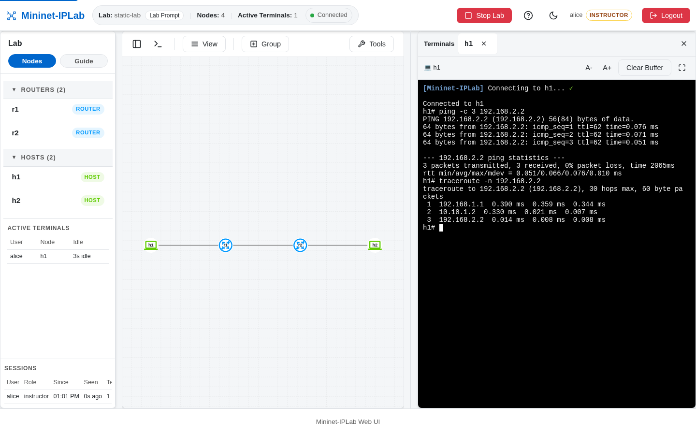
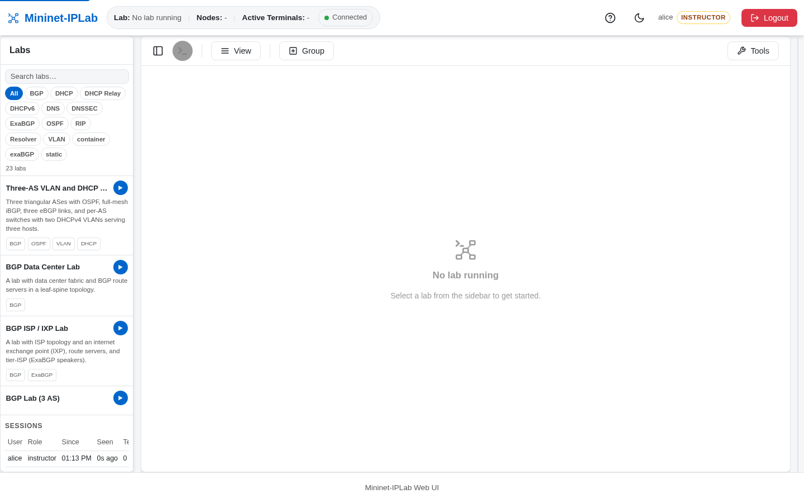

Web UI Mode is the browser surface for the same Lab you run in CLI Mode. It draws the Topology, opens a Terminal on
any Node, shows the Lab Example's Guide, and gives each Service its own panel. It does not create a second Lab or a
different Topology.



## Add it to a Lab

Nothing changes in `build_network()`. Pass the runner's arguments through to `run_lab()`:

```python
args = parse_lab_args('My Lab')
run_lab(
    build_network(),
    enable_web=args.enable_web,
    web_host=args.web_host,
    web_port=args.web_port,
    log_level=args.log_level,
)
```

Then start one Lab Example with the web server, or start the standalone server and choose a Lab in the browser:

```bash
# One Lab Example
docker compose exec mniplab python3 examples/static-lab.py --enable-web

# Standalone server: an Instructor picks a Lab from the catalog
docker compose exec mniplab mniplab serve --web-host 0.0.0.0 --web-port 8050
```

Open `http://localhost:8050`. The default single-user login is `admin` / `changeme123`; change it in `.env` before
anyone else can reach the server. See [Classroom deployment](/docs/getting-started/classroom/) for role-based accounts.

## What is on the page



- **Catalog sidebar.** With no Lab running, an Instructor sees every Lab Example from `examples/labs.json`, with
  search and protocol filters. **▶** starts one.
- **Nodes and Guide tabs.** With a Lab running, the sidebar lists the Nodes by type and, on the **Guide** tab, the
  Lab Example's Guide from `examples/guides/<lab-id>.md`. A Learner joining a running Lab lands on the Guide.
- **Topology.** Routers are blue, Hosts green, switches orange, Speakers purple, and Container Hosts Docker blue. The
  authored Layout from `examples/layouts/<lab-id>.json` places the Nodes; **View → Reset to Authored Layout** puts them
  back after you drag them, and an Instructor can **Save as Authored Layout**.
- **Terminals.** Click a Node to open a Terminal tab inside that Node: `hostname` returns the Node's name and `ps`
  lists only its processes. Each browser Session can hold five Terminals by default, and an idle one closes after
  60 seconds.
- **Node and Link menus.** Right-click a Node for its Terminal, [Packet Capture](/docs/features/packet-capture/),
  [NAT Table](/docs/features/nat/), or Service panel. Click a Link to disconnect it, reconnect it, or set its
  [Link Condition](/docs/features/link-conditions/).
- **Tools.** The **Tools** dialog runs ping, traceroute, iperf, and iperf3 between two Nodes and shows a Router's
  route, OSPF, or BGP table without opening a Terminal.
- **Lab Prompt.** The header's **Lab Prompt** button opens the network-wide `mininet-iplab>` prompt. See
  [Lab Prompt](/docs/features/lab-prompt/).

### Service panels

A Node that offers a Service carries a badge above it in the Topology. Select the badge to open that Service's panel.
What a Learner edits in a panel is Exercise Configuration: it applies to the running daemon at once and is discarded
when the Lab stops.

| Badge | Panel | Feature page |
| --- | --- | --- |
| `DHCP`, `DHCPv6` | Address Pools, Reservations, and the Active Leases table | [DHCP](/docs/features/dhcp/) |
| `DHCP RELAY` | Covered Subnets, the upstream Service, and forwarded requests | [DHCP Relay](/docs/features/dhcp-relay/) |
| `DNS`, `DNS · SECONDARY` | Zone and Record editor, replication state, DNSSEC keys, and live query counters | [Authoritative DNS](/docs/features/dns/) |
| `RESOLVER` | Cache Inspector and Access Control | [Recursive Resolver](/docs/features/dns-resolver/) |
| Speaker menu | Neighbors, announced routes, and the announce and generate forms | [ExaBGP](/docs/features/exabgp/) |
| Switch (click it) | Port modes and VLAN IDs | [VLANs and switches](/docs/features/vlans/) |

## Verify it

Start `static-lab` with `--enable-web`, sign in, and click `h1`. In its Terminal run:

```bash
ping -c 3 192.168.2.2
traceroute -n 192.168.2.2
```

The replies and the three hops `192.168.1.1 → 10.10.1.2 → 192.168.2.2` show the same path CLI Mode would. The core
[Web UI guide](https://github.com/mininet-iplab/mininet-iplab/blob/v0.1.0/docs/web-ui.md) covers every setting and
the REST API behind the page.
