Mininet-IPLab `v0.1.0` ships 23 Lab Examples. Each one below is shown running in [Web UI Mode](/docs/features/web-ui/)
with its authored Layout. Start any of them from the Web UI catalog, or from the core repository in CLI Mode:

```bash
# CLI Mode
docker compose exec mniplab python3 examples/<lab-id>.py

# Web UI Mode
docker compose exec mniplab python3 examples/<lab-id>.py --enable-web
```

Lab Examples with a **Guide** show it in the Web UI's Guide tab while the Lab runs; the link below opens the same
Guide in the core repository. **Persistent Config** Lab Examples keep Router configuration in `frr-config/`; see
[Persistent Config](/docs/build-labs/persistent-config/).

## Routing

Start here: static routes, then an interior protocol, then BGP between Autonomous Systems.

### Static Routing Lab

A lab consists of 2 routers and 2 hosts. Learning static routing fundamentals.

`static-lab` · static · 4 Nodes · Persistent Config · [source](https://github.com/mininet-iplab/mininet-iplab/blob/v0.1.0/examples/static-lab.py) · [Guide](https://github.com/mininet-iplab/mininet-iplab/blob/v0.1.0/examples/guides/static-lab.md) · [feature page](/docs/features/static-routing/)

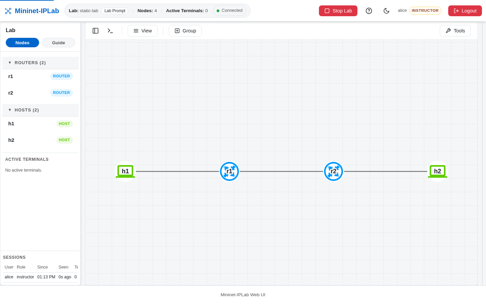

### Static Routing Lab (IPv6)

A lab with 2 routers and 2 hosts. Learning static routing with IPv6-only addressing on all links.

`static-lab-ipv6` · static · 4 Nodes · Persistent Config · [source](https://github.com/mininet-iplab/mininet-iplab/blob/v0.1.0/examples/static-lab-ipv6.py) · [feature page](/docs/features/ipv6/)

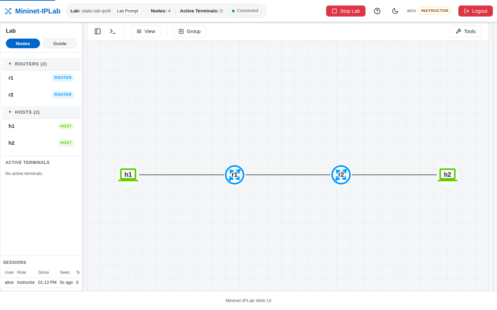

### Static Routing with NAT

A lab with static routing and NAT masquerade to simulate internet access.

`static-lab-nat` · static · 3 Nodes · [source](https://github.com/mininet-iplab/mininet-iplab/blob/v0.1.0/examples/static-lab-nat.py) · [feature page](/docs/features/nat/)

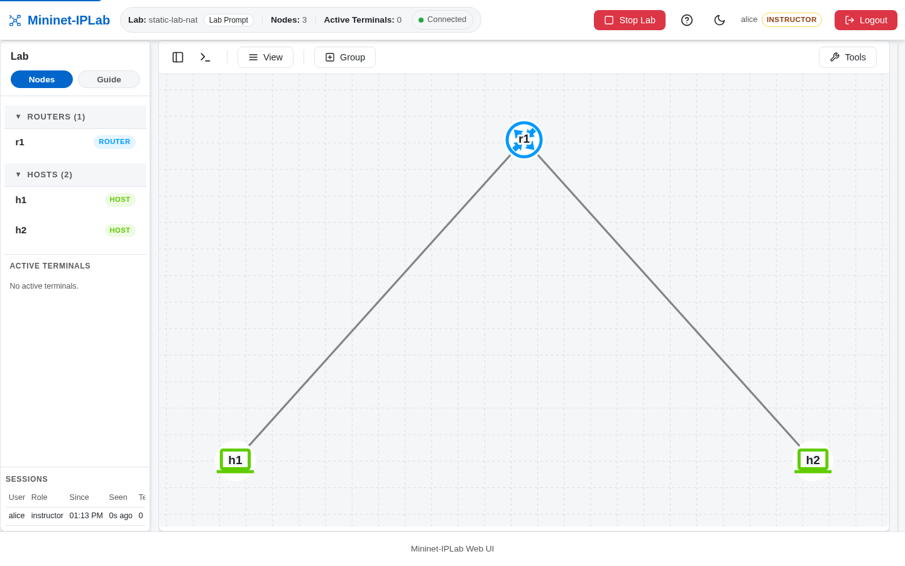

### OSPF Routing Lab

A lab with 3 areas, area border routers, and 9 routers total. Learning OSPF dynamic routing fundamentals.

`ospf-lab` · OSPF · 18 Nodes · Persistent Config · [source](https://github.com/mininet-iplab/mininet-iplab/blob/v0.1.0/examples/ospf-lab.py) · [feature page](/docs/features/ospf/)

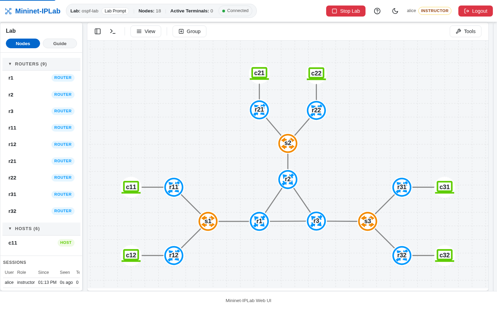

### BGP Lab (3 AS)

A lab consists of 3 AS, each with 2 eBGP sessions and iBGP sessions. Learning BGP fundamentals.

`bgp-lab` · BGP, OSPF · 15 Nodes · Persistent Config · [source](https://github.com/mininet-iplab/mininet-iplab/blob/v0.1.0/examples/bgp-lab.py) · [Guide](https://github.com/mininet-iplab/mininet-iplab/blob/v0.1.0/examples/guides/bgp-lab.md) · [feature page](/docs/features/bgp/)

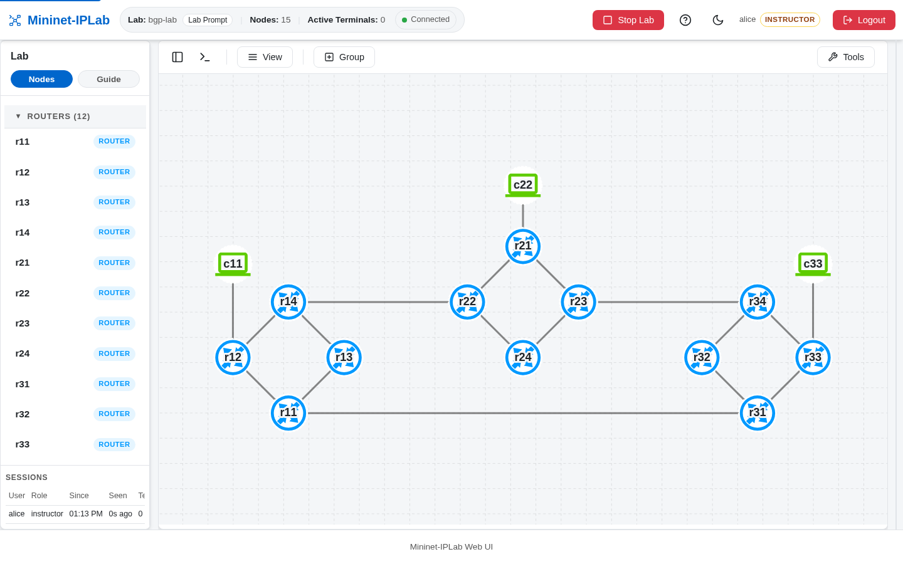

### BGP MED / Local Preference Lab

A lab with BGP path selection using MED and Local Preference attributes for traffic engineering.

`bgp-medlopref-lab` · BGP · 8 Nodes · Persistent Config · [source](https://github.com/mininet-iplab/mininet-iplab/blob/v0.1.0/examples/bgp-medlopref-lab.py) · [feature page](/docs/features/bgp/)

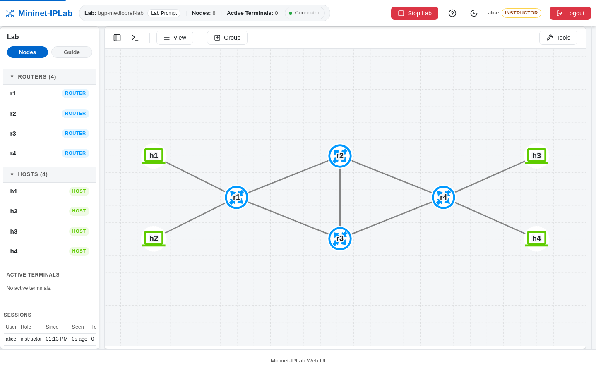

### BGP Multipath Lab

A lab with BGP multipath routing demonstrating equal-cost load balancing across multiple paths.

`bgp-multipath-lab` · BGP · 8 Nodes · Persistent Config · [source](https://github.com/mininet-iplab/mininet-iplab/blob/v0.1.0/examples/bgp-multipath-lab.py) · [Guide](https://github.com/mininet-iplab/mininet-iplab/blob/v0.1.0/examples/guides/bgp-multipath-lab.md) · [feature page](/docs/features/bgp/)

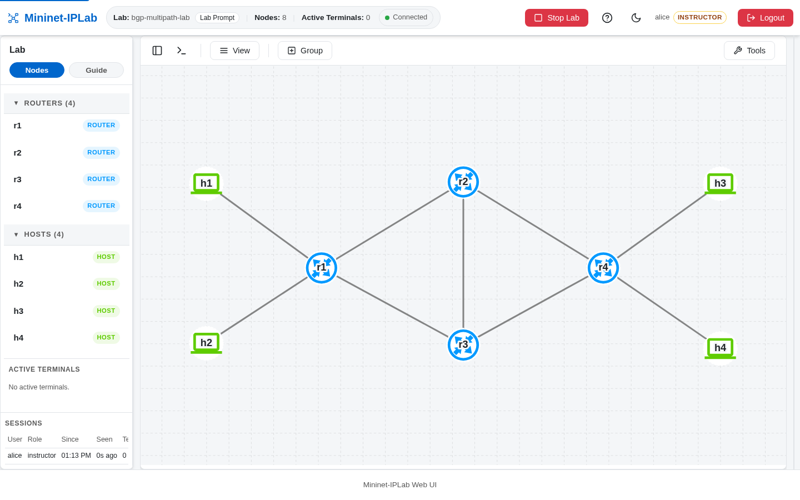

### BGP 2 ISP Lab

A lab with 2 ISPs exchange its customer networks. Internet is emulated via NAT at each ISP's node.

`bgp-nat-isp-lab` · BGP, OSPF, exaBGP · 14 Nodes · Persistent Config · [source](https://github.com/mininet-iplab/mininet-iplab/blob/v0.1.0/examples/bgp-nat-isp-lab.py) · [Guide](https://github.com/mininet-iplab/mininet-iplab/blob/v0.1.0/examples/guides/bgp-nat-isp-lab.md) · [feature page](/docs/features/nat/)

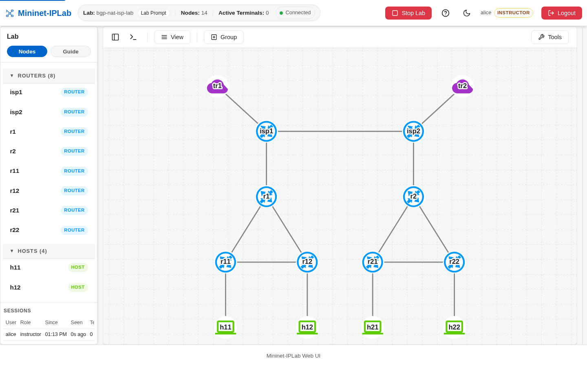

### BGP Data Center Lab

A lab with data center fabric and BGP route servers in a leaf-spine topology.

`bgp-dc-lab` · BGP · 10 Nodes · Persistent Config · [source](https://github.com/mininet-iplab/mininet-iplab/blob/v0.1.0/examples/bgp-dc-lab.py) · [feature page](/docs/features/bgp/)

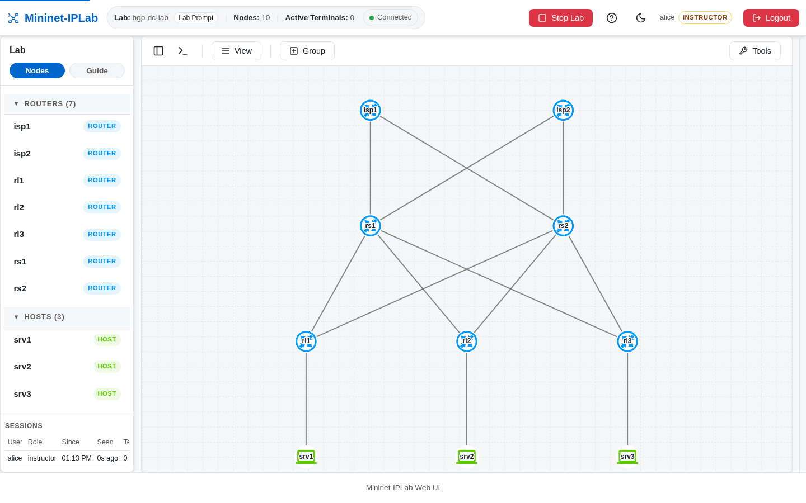

### BGP ISP / IXP Lab

A lab with ISP topology and an internet exchange point (IXP), route servers, and tier-ISP (ExaBGP speakers).

`bgp-ispixp-lab` · BGP, ExaBGP · 19 Nodes · Persistent Config · [source](https://github.com/mininet-iplab/mininet-iplab/blob/v0.1.0/examples/bgp-ispixp-lab.py) · [feature page](/docs/features/exabgp/)

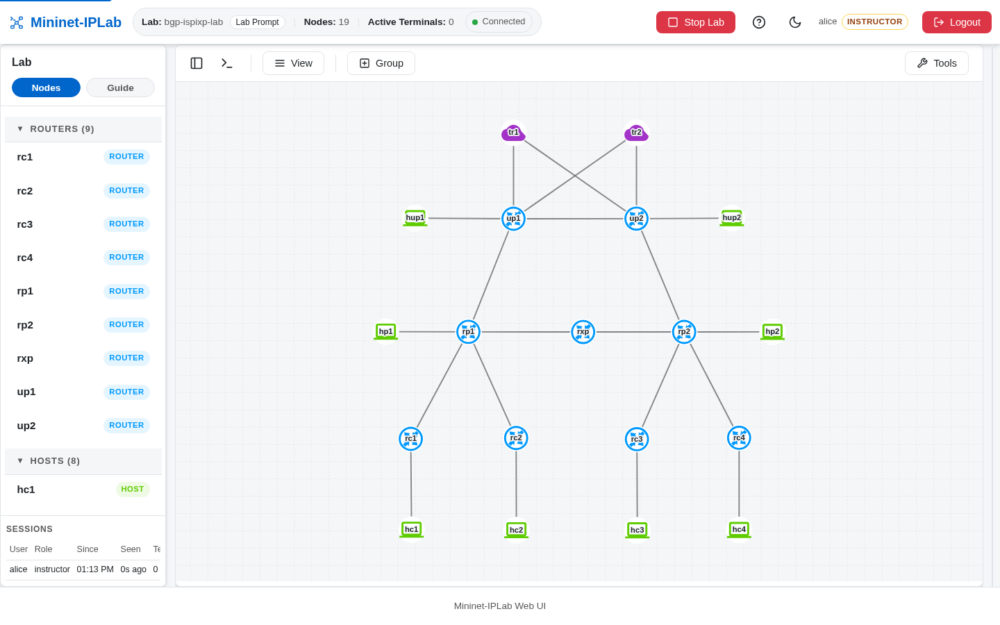

### Three-AS VLAN and DHCP Benchmark Lab

Three triangular ASes with OSPF, full-mesh iBGP, three eBGP links, and per-AS switches with two DHCPv4 VLANs serving three hosts.

`benchmark-flagship-lab` · BGP, OSPF, VLAN, DHCP · 21 Nodes · [source](https://github.com/mininet-iplab/mininet-iplab/blob/v0.1.0/examples/benchmark-flagship-lab.py) · [Guide](https://github.com/mininet-iplab/mininet-iplab/blob/v0.1.0/examples/guides/benchmark-flagship-lab.md) · [feature page](/docs/features/vlans/)

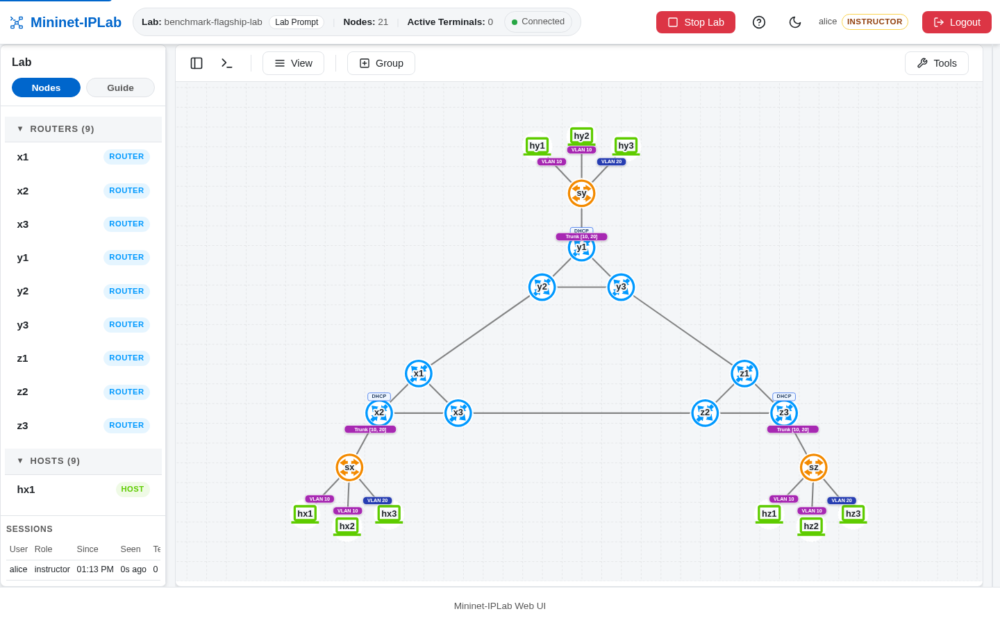

## BGP Speakers (Experimental)

An ExaBGP Speaker announces and withdraws routes on demand.

### ExaBGP Lab

A lab with BGP route injection using an ExaBGP speaker with FIFO-based runtime control.

`exabgp-lab` · BGP, ExaBGP · 3 Nodes · Persistent Config · [source](https://github.com/mininet-iplab/mininet-iplab/blob/v0.1.0/examples/exabgp-lab.py) · [feature page](/docs/features/exabgp/)

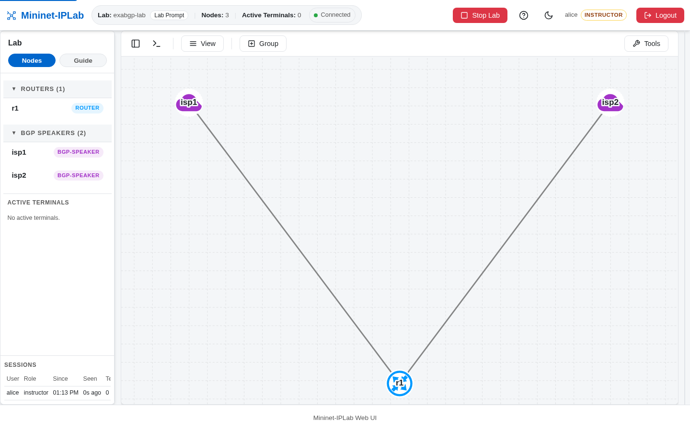

### ExaBGP IPv6 Lab

A lab with ExaBGP IPv6 peering using dual-stack BGP sessions and IPv6 route announcement.

`exabgp-ipv6-lab` · BGP, ExaBGP · 3 Nodes · Persistent Config · [source](https://github.com/mininet-iplab/mininet-iplab/blob/v0.1.0/examples/exabgp-ipv6-lab.py) · [feature page](/docs/features/exabgp/)

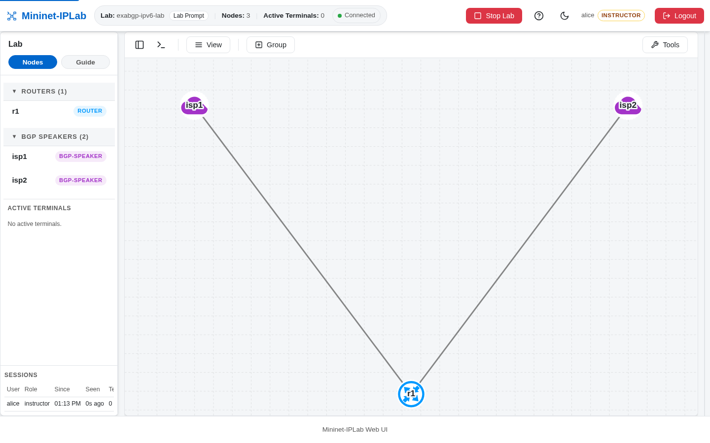

## DHCP

Address allocation, from one Router serving its own Subnets to a central Service behind Relays.

### DHCP Lab

A Router serves DHCP on two of its three Subnets, with a Reservation, a short lease time, and delivered options.

`dhcp-lab` · DHCP · 4 Nodes · [source](https://github.com/mininet-iplab/mininet-iplab/blob/v0.1.0/examples/dhcp-lab.py) · [Guide](https://github.com/mininet-iplab/mininet-iplab/blob/v0.1.0/examples/guides/dhcp-lab.md) · [feature page](/docs/features/dhcp/)


### DHCP Lab (rogue server)

Two DHCP Services on one Subnet: a client races between the intended Service and a rogue one.

`dhcp-lab-rogue` · DHCP · 4 Nodes · [source](https://github.com/mininet-iplab/mininet-iplab/blob/v0.1.0/examples/dhcp-lab-rogue.py) · [Guide](https://github.com/mininet-iplab/mininet-iplab/blob/v0.1.0/examples/guides/dhcp-lab-rogue.md) · [feature page](/docs/features/dhcp/)

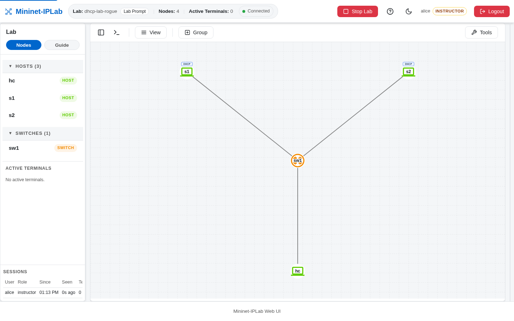

### DHCPv6 Lab

One Router, three Subnets staging the Router Advertisement outcomes: M set (an address arrives), O only (DNS without an address), and none at all (nothing happens).

`dhcpv6-lab` · DHCPv6 · 4 Nodes · [source](https://github.com/mininet-iplab/mininet-iplab/blob/v0.1.0/examples/dhcpv6-lab.py) · [Guide](https://github.com/mininet-iplab/mininet-iplab/blob/v0.1.0/examples/guides/dhcpv6-lab.md) · [feature page](/docs/features/dhcpv6/)

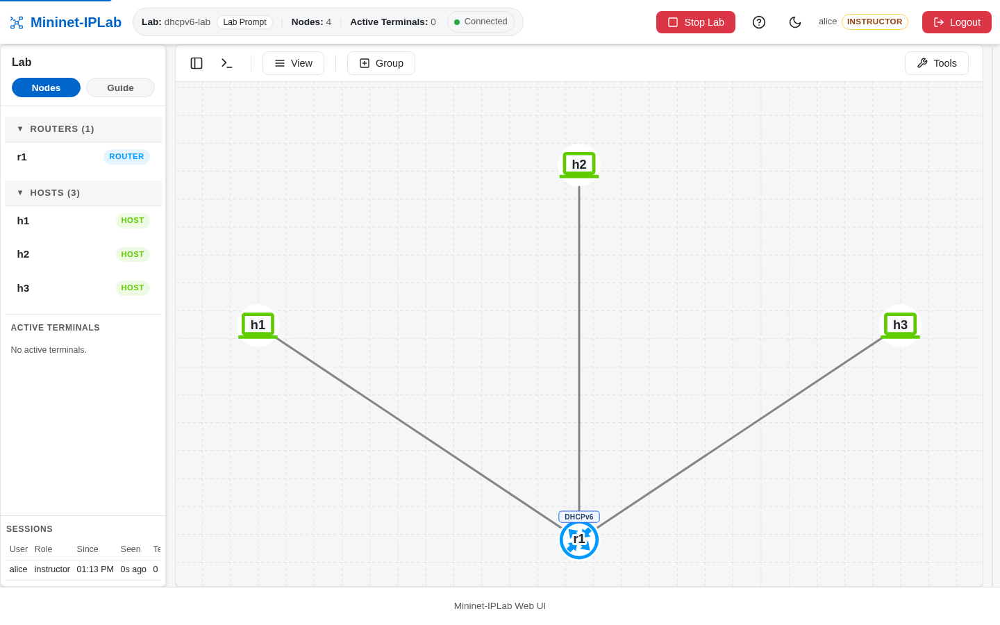

### DHCP Relay Lab

A central DHCP Service with one directly served Subnet and one relayed Subnet, dual-stack, with hardware reservations and a staged failure.

`dhcp-relay-lab` · DHCP, DHCP Relay · 6 Nodes · [source](https://github.com/mininet-iplab/mininet-iplab/blob/v0.1.0/examples/dhcp-relay-lab.py) · [Guide](https://github.com/mininet-iplab/mininet-iplab/blob/v0.1.0/examples/guides/dhcp-relay-lab.md) · [feature page](/docs/features/dhcp-relay/)

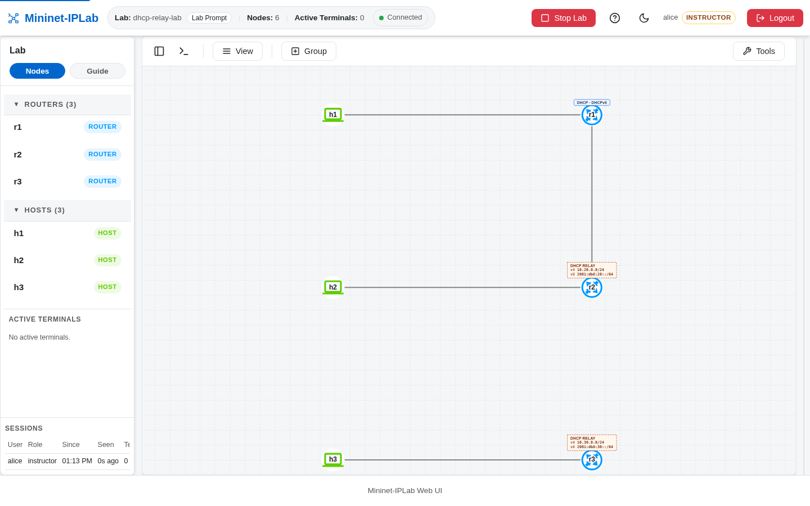

## DNS

Authoritative Zones, replication, recursive resolution, and DNSSEC validation.

### Authoritative DNS Lab

An authoritative DNS server serves forward and reverse zones for two client hosts across a routed topology.

`dns-lab` · DNS · 4 Nodes · [source](https://github.com/mininet-iplab/mininet-iplab/blob/v0.1.0/examples/dns-lab.py) · [Guide](https://github.com/mininet-iplab/mininet-iplab/blob/v0.1.0/examples/guides/dns-lab.md) · [feature page](/docs/features/dns/)

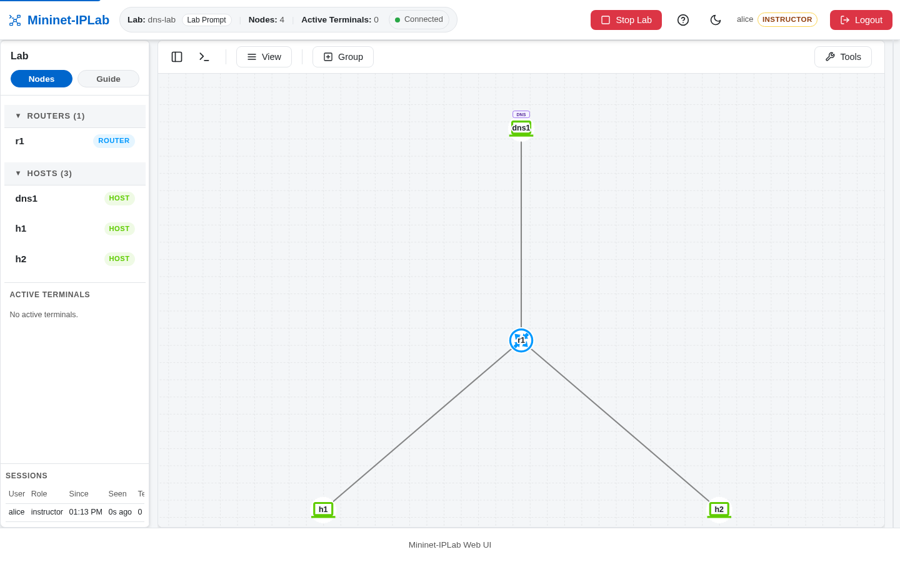

### Secondary Nameserver Lab

A Primary and a Secondary nameserver either side of a RIP core replicate one Zone by Zone Transfer, so Notify, the Serial, and the SOA retry and expire timers are all observable.

`dns-secondary-lab` · DNS, RIP · 5 Nodes · [source](https://github.com/mininet-iplab/mininet-iplab/blob/v0.1.0/examples/dns-secondary-lab.py) · [Guide](https://github.com/mininet-iplab/mininet-iplab/blob/v0.1.0/examples/guides/dns-secondary-lab.md) · [feature page](/docs/features/dns-secondary/)

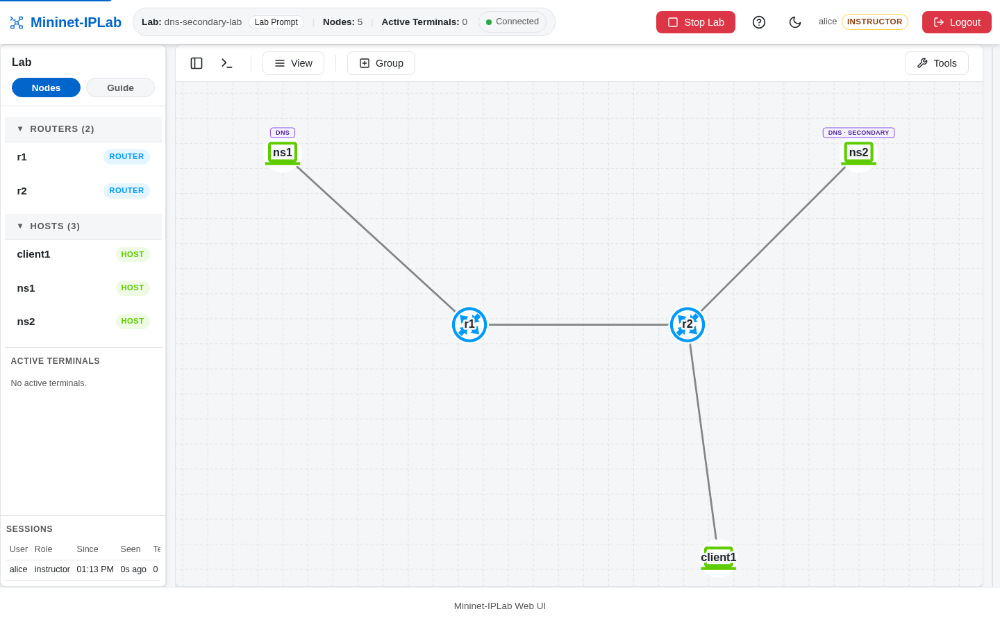

### Recursive Caching Resolver Lab

A Recursive Caching Resolver walks an in-lab Root -> TLD -> Authoritative hierarchy for one client, so cold versus warm resolution, TTL decay, negative caching, and Access Control are all visible.

`dns-resolver-lab` · DNS, Resolver · 6 Nodes · [source](https://github.com/mininet-iplab/mininet-iplab/blob/v0.1.0/examples/dns-resolver-lab.py) · [Guide](https://github.com/mininet-iplab/mininet-iplab/blob/v0.1.0/examples/guides/dns-resolver-lab.md) · [feature page](/docs/features/dns-resolver/)

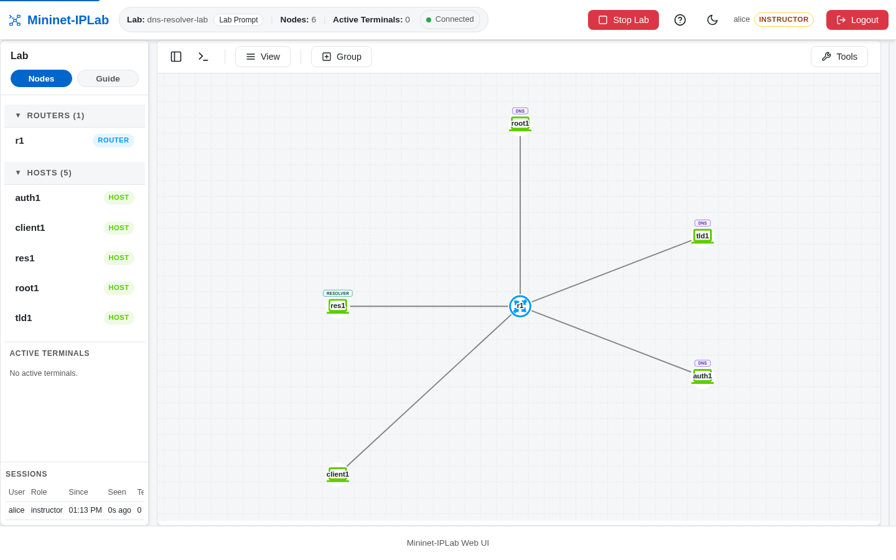

### DNSSEC Flagship Lab

A signed Root -> TLD -> Authoritative hierarchy and a validating Resolver, so the chain of trust, the AD flag, a broken DS delegation, authenticated denial of existence, and a ZSK rollover are all observable.

`dnssec-lab` · DNS, DNSSEC, Resolver · 7 Nodes · [source](https://github.com/mininet-iplab/mininet-iplab/blob/v0.1.0/examples/dnssec-lab.py) · [Guide](https://github.com/mininet-iplab/mininet-iplab/blob/v0.1.0/examples/guides/dnssec-lab.md) · [feature page](/docs/features/dnssec/)

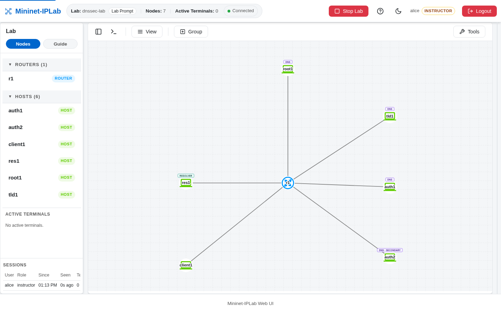

## Switching and Nodes

Layer 2 segmentation and real application software inside a Lab.

### VLAN & Inter-VLAN Routing Lab

A lab with 802.1Q VLANs, access ports, trunking, and router-on-a-stick inter-VLAN routing.

`vlan-lab` · VLAN, static · 5 Nodes · [source](https://github.com/mininet-iplab/mininet-iplab/blob/v0.1.0/examples/vlan-lab.py) · [Guide](https://github.com/mininet-iplab/mininet-iplab/blob/v0.1.0/examples/guides/vlan-lab.md) · [feature page](/docs/features/vlans/)

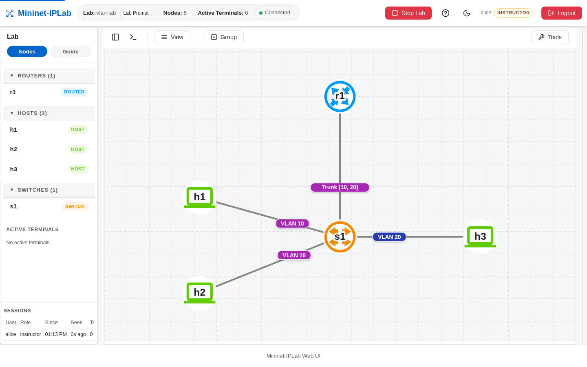

### Container Node Lab

A minimal lab showing a Docker-backed node connected to a switch and host.

`container-lab` · container · 3 Nodes · [source](https://github.com/mininet-iplab/mininet-iplab/blob/v0.1.0/examples/container-lab.py) · [feature page](/docs/features/container-hosts/)

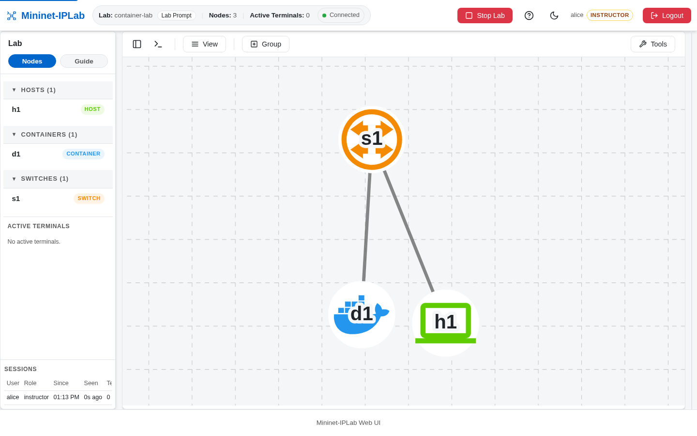
